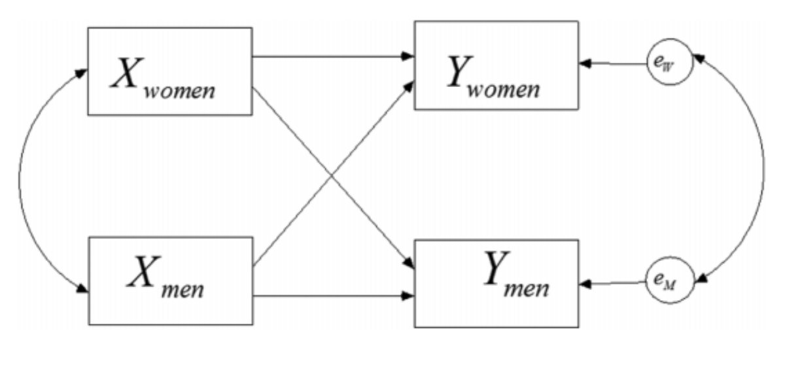
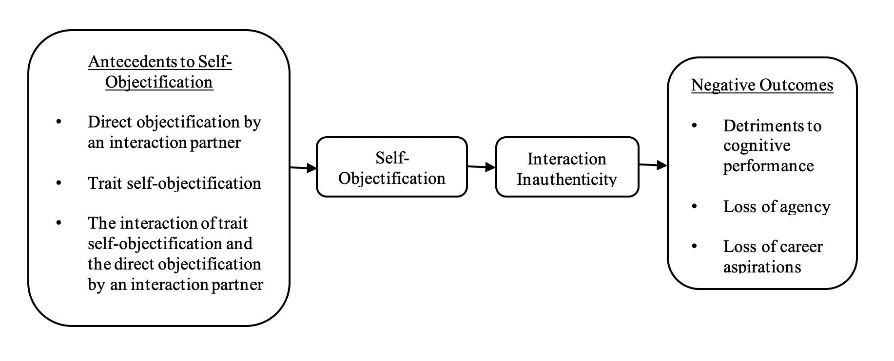
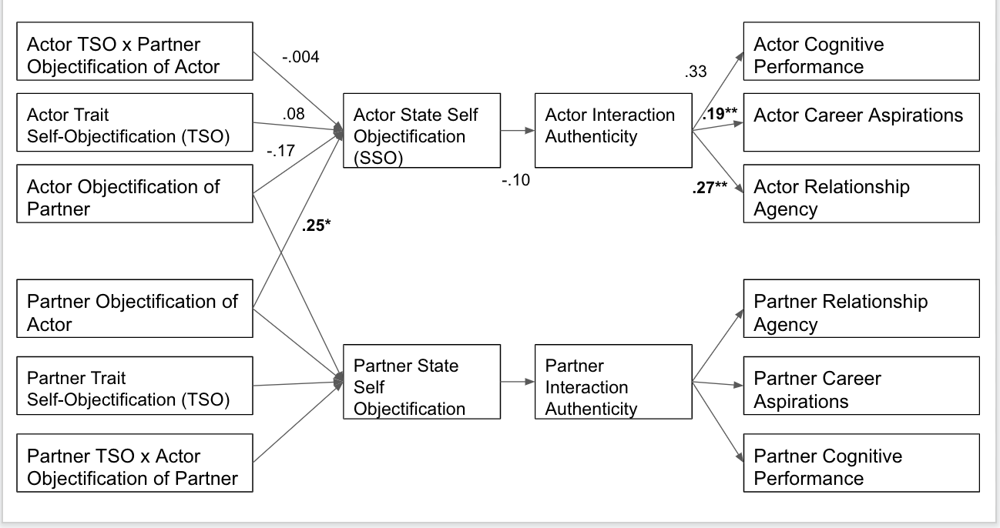

```{r setup, analysis-preferences}
# Seed for random number generation
set.seed(42)
knitr::opts_chunk$set(cache.extra = knitr::rand_seed, include = FALSE)
```

```{r packages, warning = FALSE, message = FALSE}
library(papaja)
library(nlme)
library(haven)
library(devtools)
library(psych)
library(mosaic)
#library(dyadr)
library(tidyr)
library(dplyr)
library(irr)
library(apaTables)
library(knitr)
library(kutils)
library(tidyverse)
library(lavaan)
library(xtable)
library(rmarkdown)
```
    
@robertsfredrickson Objectification Theory, suggests that, in addition to being steeped in a culture that objectifies women, women are objectified in actual interpersonal encounters. The negative effects of this interpersonal objectification for women are theorized be the strongest when it is a man doing the objectifying [@calogero2004test; @gervais2011you; @gay2010my], but what are the consequences when a woman objectifies another woman in an interaction? Psychological researchers studying the sexual objectification of women, have in recent years explored the interpersonal process of the objectification, finding evidence for self-objectification in the target as a proximal consequence of being objectified [@garcia2016objectification, @strelan2018birds, @riemer2020self]. In a recent review, @gervais2020social organized the extant literature on interpersonal self-objectification and proposed a theoretical model called the Social Interaction Model of Objectification (SIMO), however this model focuses on mixed-gender encounters. Although there is evidence that women objectify other women [@loughnan2015exploring; @puvia2013being], there are currently no studies investigating the process of interpersonal objectification in interactions between women. Is objectification by a female interaction partner related to an increase in self-objectification for the woman being objectified? Further, does objectification by a woman have the same downstream negative consequences for women as being objectified by a male interaction partner? The current study begins to address these questions by investigating interpersonal objectification among interacting pairs where both partners identify as women. 

##Self-Objectification
Self-objectification is a psychological process that provides a cognitive mechanism to translate the experiences of interpersonal objectification [@loughnan2015exploring] to negative mental health outcomes (e.g., anxiety, self-esteem, and cognitive performance) [@calogero2011; @moradi2008]. @calogero2011 proposes that self-objectification can be conceptualized as a learned trait, or *trait* self-objectification (TSO). Furthermore, self-objectification can also be elicited momentarily, for example, when viewing sexualized images in movies and magazines [@morry2001magazine], when trying on sexualizing clothing [@fredrickson1998swimsuit], or during video chat when you believe your interaction partner can only see your body [not face; @saguyetal2010]. This momentary self-objectification is referred to as *state* self-objectification [SSO; @bernard2018bodies; @calogero2011; @moradi2008] and is characterized by feeling like a body rather than a full self within a particular moment, instance, or context [@robertsfredrickson]. 

There is evidence that being objectified by another person during an interaction elicits SSO. For example, in a face-to-face mixed-gender dyadic study, @garcia2016objectification found that men’s reported objectification of their female interaction partner was associated with increased self-objectification as reported by their female partner. Further, this negative effect of the men's objectification on women's SSO was strongest for women higher in TSO. The current study uses this same dyadic paradigm to study same-gender, woman-woman interacting pairs. 

##Interpersonal Objectification
Studies have shown that within social encounters women are gazed at more than men [@briton1995], often times feel ‘looked at’ within interpersonal interactions [@argyle1969; @miles2015stop], and are likely to internalize the objectifying gaze on their physical self [@puvia2013being; @young1979]. Interpersonal objectification has been found to have negative consequences for women. @gervais2011you found that an objectifying gaze by a male interaction partner (confederate) was associated with lower math performance for women, than being objectified by a female interaction partner. Moreover, perhaps the most adverse effect of interpersonal objectificaiton is that being objectified socializes girls and women to treat themselves as objects to be looked at and evaluated [@Bartky; @berger1972; @fredrickson1998swimsuit]. @gervais2020social recently reviewed the research on interpersonal objectification and organized our current theoretical understanding of this process in the Social Interaction Model of Objectification (SIMO). What is clear from @gervais2020social's review is that we know little about women-on-women interpersonal objectification. Could there also be negative consequences of this type of interpersonal objectification? 

Interpersonal objectification can also occur within the context of romantic relationships, in addition to interactions with strangers. Among heterosexual male and female college students, self-objectification has been found to be positively associated with the extent to which they objectify their romantic partners [@zurbriggen2011self]. Researchers have also studied interpersonal objectification and self-objectification in romantic relationships [@strelan2018birds]. Evidence is mixed, suggesting that women can sometimes have positive outcomes from appearance valuation within the context of an established romantic relationship. There is also evidence that they experience less SSO after appearance comments within romantic relationships [@meltzer2020women], but less is known about first dates. An important caveat to this literature is that it is only about heterosexual relationships. A recent study has investigated the effect of self-objectification on the reduction of relationship building skills in general (including same-sex friendships) [@teran2020relational]. Both romantic relationships and stranger encounters have been studied in the context of objectification, but neither of these literatures have investigated specifically same-gender relationships.

There is evidence that the experience of state self-objectification in mixed-gender contexts (stranger and romantic) has negative consequences for women, but what about in the context of interactions with other women? Is the self-objectification experienced in mixed-gender interactions associated with the same negative process as that experienced in same-gender interactions? The ample research demonstrating that the male gaze has a particularly detrimental effect for women would suggest no [@saguyetal2010, @calogero2004test; @gervais2011you; @gay2010my; @yilmaz2019whose], but, there is evidence that women do objectify other women [@puvia2013being; @loughnan2015exploring; @harsey2020men] and to would be helpful to understand the consequencs of this intragroup objectification for women. When women objectify other women, does it lead to self-objectification in the same way men's objectification of women does [@garcia2016objectification]? If so, does the self-objectification experienced in these same-gender interactions have the same negative consequences for authenticity in that interaction?  

There is some evidence that reduced authenticity is a consequence of self-objectification [@garcia2016objectification; @teran2020relational]. This link has been justified by the literature on stigmatized-stigmatizer interactions [@hebl2005promoting; @richeson2003prejudice; @shelton2005expecting], viewing the experience of being objectified in an interaction as an identity threat situation [@miles2015stop; @nadal2012effects]. Further, empirical evidence reveals that objectification manifests through inauthenticity in romantic relationships [@brunelletal2010], adverse attitudes in regard to career aspirations, and a decrease in concentration and impairment in female cognitive performance [@kahalon2018don; @quinnetal]. When a woman is objectified by a man, and subsequently experiences self-objectification, the intergroup nature of this encounter might trigger identity threat. Thus, perhaps there are fewer negative consequences when a woman is objectified by another woman, specifically, woman-woman interpersonal objectification processes might diverge from mix-gender interpersonal objectification processes precisely because they are not intergroup interactions (at least with respect to gender identity). A woman objectified by another woman may not be having the same negative consequences that cascade from situations that trigger group-based identity threat [@deaux1987putting; @dovidio2006nonverbal; @hebl2005promoting], but feeling like a body, rather than a full human, in any interaction (intergroup or ingroup) may be enough to reduce women's feelings of authenticity and social competence, regardless of the gender of the objectifyer [@tolman2006looking; @teran2020relational].

##Women Objectifying Women
Past research investigating women objectifying other women has focused on the psychological conditions that led women to objectify women. @harsey2020men found that self-objectification was related to the objectification of women to a similar degree for male and female participants. Along the same lines, @strelan2005women found that the more women self-objectify, the more they objectify other women. Could the process work in the other direction as well, that is, could objectification by a woman produce self-objectification, in a similar manner to objectification by a man? @hill2008examining assessed women’s experiences of objectification from men independently from women’s experiences of objectification from other women. They found that women may be socialized not only to see themselves as objects, but perhaps to see other women as objects as well. This process, however, was not comfirmed to occur during an actual interpersonal interaction. @loughnan2015exploring found that women objectify other women to a greater extent than they objectify men. Women have also been found to objectify (dehumanized) sexualized targets presented as images [@puvia2013being], but very little is known about interpersonal sexual objectification among women and what the proximal effects of this objectification might be. We do know that objectification has more adverse consequences for women than men [@gervais2011you; @moradi2008; @saguyetal2010], however, if women objectify other women, perhaps even to a stronger degree than they objectify men, this woman to woman objectification might have detrimental outcomes. 

##The Current Study
In the current study, we sought to examine what occurs during an interaction in which one or both partners are objectifying each other, similarly to @garcia2016objectification, but between same-gender interpersonal interactions among women. Moreover, the current study uses a face-to-face interaction paradigm and dyadic data analysis techniques to examine the effects for both women simultaneously. Although the literature on woman-woman objectification is small, the results are mixed, and does not cover interpersonal encourters, we expected to replicate some of the results found in @garcia2016objectification. Most importantly, we predicted that being objectified by one’s interaction partner would lead to self-objectification. We also expected that TSO would moderate this relationship, amplifying the positive assocaition between being objectified and SSO for women higher in TSO. We hypothesized that SSO would, in turn, lead to feelings of inauthenticity [although there is ample support against this prediction from the identity threat within intergroup interactions literature; @rollero2016bringing]. Further, we hypothesized that these feelings of inauthencity would then be associated with reduced feelings of agency in romantic relationships, reduced career aspiration, and reduced cognitive performance. In summary, we expected to find a positive relationship between other-objectification by one's partner and state self-objectification. We also expected to find a negative relationship between self-state objectification and interaction authenticity, and that interaction authenticity will be positively related to cognitive performance, relationship agency, and career aspirations.

These hypotheses are considered exploratory, given the lack of prior research theorizing about these linkages.

Here we would like to note that @puvia2013being would alternatively predict that women's tendency to self-objectify (TSO) leads them to objectify other women (more precisely, to dehumanize a sexualized woman). In addition, @strelan2005women and @harsey2020men would predict the TSO to other-objectification link, further theorizing that this relationships is mediated by the woman's own state self-objectification (SSO). This limited, but extant, set of literature on woman-woman objectification points to a possible alternative model from the model hypothesized in the current study. Where appropriate, we report results considering the causal directions implied by this alternative mediation model.

# Methods

##Procedure
Except for the instructions given to participants, the procedure used was identical to that in @garcia2016objectification. In brief, that methodology is that each participant arrived at the laboratory and were then led into separate cubicles to prevent any communication between the participants before the interaction. In addition, each participant was screened for prior acquaintance to confirm that they had not met prior to the study. They were asked to sign the consent form to participate, and the study was described as follows: “This is a study looking at how students form different types of relationships at college.” A prompt on the computer screen told the participants that they were assigned to the “College Relationships” condition and gave the following instructions:

>There are many types of relationships people form in college. During the interaction, please think about your partner's potential as a romantic partner. **Even if they are not the gender you are attracted to**, you can still judge their potential as a romantic partner. After the interaction you will be asked to evaluate how dateable your partner is. In other words, we would like to know if you think someone would date your interaction partner. Also, your interaction partner will be evaluating you in the same manner. 

*All* participants were told that they were assigned to the "College Relationships" condition. Self-objectification has been found to occur after a mere relationship prime among women [@sanchez2008romance] because, in Westurn culture and beyond, women need to look attractive to obtain and maintain successful relationship, thus, the "College Relationships" condition may heighten self-objectification and the evaluation of other women in a sexualized way. The decision was made to ask even heterosexual women to judge their fellow-woman partners for their potential as romantic partners. We felt that this prompt would keep the study closest to a replication of the previous @garcia2016objectification version of the study, and strengthen the potential for objectification that would normally be low in the context of a psychology laboratory. Recall that, past research has found that heterosexual women are indeed able to evaluate other women's potential as romantic partners [i.e., their sexual attractiveness; @puvia2013being]---indeed, women may be unfortunately quite used to thinking about their own "datability," and we suspect this this habitual thought pattern will translate to their thoughts about other women. 

After recieving the "College Relationships" prompt, the two participants were then brought into a larger interaction room where they sat on stools prearranged to be approximately 1 meter apart. The experimenter instructed the participants to “get to know each other” for 10 minutes and then left the room. After 10 minutes, the experimenter came back into the room and stopped the interaction. The participants then went back to their individual cubicles and completed a set of post-interaction measures. Participants were then thanked for their participation and debriefed. More detail on this methodology can be found in @garcia2016objectification.

##Participants

```{r data}
clark_final <- read.csv("Cleaned data/clark_final.csv")
smith_final <- read.csv("Cleaned data/smith_final.csv")
clarksmith_women <- read.csv("Cleaned data/clarksmith_women.csv")
```

```{r}
ns <- clarksmith_women %>%
  group_by(smith_or_clark) %>%
  summarise(n = n()) %>%
  as.matrix() %>% as.numeric()
```

Data from two demographically similar higher education institutions in the Northeast United States were combined to create the final analysis sample (*N =* `r nrow(clarksmith_women)`) used in this study. In the measures section that follows we refer to them as Sample 1 and Sample 2. Thirty-two previously unacquainted self-identifying female dyads (64 total participants) from institutions in the Northeast of the United States participated in this study. Sample 1 (*N =* `r ns[3]`) is from a co-ed liberal arts college and Sample 2 (*N =* `r ns[4]`) is from a women’s liberal arts college. More specifically, twelve of the pairs were students at a co-ed liberal arts college, while the remaining twenty pairs attended a women’s liberal arts college. [Footnote: Initially, data was collected from same-sex and mixed-sex dyads that comprised of male and female gendered individuals. Sample 1 originally consisted of twenty-two pairs, twelve men and thirty-two women. Twenty-three pairs made up of forty-three women and one man, as well as two participants who did not identify with either gender category, formed Sample 2. For consistency, we limited participant data to same sex female pairs at the two colleges.] All results presented below are from models including sample as a control variable.

```{r demographics}
#favstats(~TSO_A, data=clarksmith_women)
#favstats(~a2pSOO_A, data=clarksmith_women)
#favstats(~howbody_avg_A, data=clarksmith_women)
#favstats(~relag_A, data=clarksmith_women)
#favstats(~careerasp_A, data=clarksmith_women)
#favstats(~authenticity_A, data=clarksmith_women)
#favstats(~trigram_score_A, data=clarksmith_women)

#Mean and SD of age of sample
mean_age <- favstats(~age_A, data = clarksmith_women)$mean
sd_age <- favstats(~age_A, data = clarksmith_women)$sd
tally(clarksmith_women$race_A == clarksmith_women$race_P)

#Calculating race percentages
tally(~race_A, data = clarksmith_women)  #Note that we can add "format = percentage" and not need to calculate
percentage_black <- 6/(6+18+31+6+3)*100
percent_asian <- 18/(6+18+31+6+3)*100
percent_white <- 31/(6+18+31+6+3)*100
percent_latinx <- 6/(6+18+31+6+3)*100
percent_other <- 3/(6+18+31+6+3)*100
tally(~sexor_A, data=clarksmith_women)
percent_straight <-(41/64)*100
percent_queer <- (3+8+5)/64*100
tally(~gender_A, data=clarksmith_women)

table(clarksmith_women$race_A, clarksmith_women$race_P)
samerace_white <- 16/2 #divide by 2 since table is people, not pairs
samerace_minority <- (6+2)/2
mixedrace_white <- 2+10+2+1
mixedrace_minority <- 1+2+1+1

test <- clarksmith_women %>%
  filter(race_A==3, race_A!=race_P)

tally(~gender, data=clark_final)
tally(~gender, data=smith_final)
```

The participants were mostly first-year college students, with an average age of `r mean_age` (SD = `r sd_age`). The sample was `r percent_white`% White/European American, `r percentage_black`% Black/African-American, `r percent_asian`% Asian/Pacific Islander, `r percent_latinx`% Latinx, and `r percent_other`% mixed-race. There were `r samerace_white` White/White pairs and `r samerace_minority` same race racial minority pairs, for a total of `r samerace_white + samerace_minority` same-race pairs. The remaining `r mixedrace_white + mixedrace_minority` were mixed race pairs, of which `r mixedrace_white` were White/racial minority pairings and `r mixedrace_minority` were cross-racial minority group pairs. `r percent_straight`% of the sample identified as heterosexual, and `r percent_queer`% identified as gay, lesbian or bisexual. 

##Post interaction Measures

```{r correaltions}
#NOT SURE WHAT THIS CHUNK WAS FOR BUT ITS NOT NEEDED

# clarksmith_correlations <- clarksmith_women %>%
#   select(TSO_A, authenticity_A, a2pSOO_A, howbody_avg_A, 
#          relag_A, careerasp_A,  trigram_score_A, TSO_P, 
#          authenticity_P, a2pSOO_P, howbody_avg_P, 
#          relag_P, careerasp_P, trigram_score_P)
# 
# #Correlation tables
# correlations <- apa.cor.table(clarksmith_correlations, table.number=1)
```

```{r corrtable, include=TRUE, echo=FALSE, results='asis'}
#Table 1
glrstab<- function(x, export=FALSE) {
 
 r <-corr.test(x)$r	#taking just the correlation matrix; no N, or p
 p <-corr.test(x)$p	#taking the p*s
 
#define notions for significance levels
 mystars <- ifelse(p < .001, "**"
                   , ifelse(p < .01, "**"
                            , ifelse(p < .05, "*"
                                     , ifelse(p < .10, "+", " "))))
 
 #round r, define new matrix Rnew with the correlations from rnd and paste mystars
 rnd  <- papaja::printnum(r, gt1 = FALSE, digits = 2)  #round, drop leading 0 - Thanks CRSH!								                     
 Rnew <- matrix(paste(rnd, mystars, sep=""), ncol=ncol(rnd)) 
 
#remove 1.0 correlations from diagonal and set the strings
 diag(Rnew) <- ''		
 Rnew[upper.tri(Rnew)] <- ''								                	
 
 rownames(Rnew) <- paste(1:ncol(rnd), colnames(rnd), sep=" ")         #define number and name
 colnames(Rnew) <- paste(1:ncol(rnd), "", sep="") 			       #define number
 
#fun-part: we trim the top half 
 Rnew[upper.tri(Rnew)] <- ''			
 Rnew
 
 Rnew <- cbind(round(describe(x)[,3:4],2), Rnew)		 #describe x, M sD - put them in the matrix
 colnames(Rnew)[1:2] <- c("M","SD")			#Beschriftung der neuen Spalten-"labeling of the new columns"
 Rnew <- Rnew[,1:(ncol(Rnew)-1)]							   	#delete the last column (ugly)
 
 #export to clipboard
 
   if (export==TRUE){
   result<-write.table(Rnew
                       , "clipboard"
                       , sep=";"
                       , row.names=FALSE)
 }
 else result <- Rnew
 return(result)
 
}

corr_cswomen <-clarksmith_women %>%
  select(TSO_A, a2pSOO_A, a2pSOO_P, howbody_avg_A, authenticity_A, relag_A, trigram_score_A, careerasp_A)

corr.table <- glrstab(corr_cswomen)
rownames(corr.table) <- c("1. Actor's trait self objectification (TSO)", "2. Actor's objectification of partner", "3. Partner's objectification of the actor", "4. Actor's state self-objectification", "5. Actor's authenticity of interaction", "6. Actor's future relationship agency", "7. Actor's cognitive performance", "8. Actor's career aspirations")
colnames(corr.table)   <- c("$M$", "$SD$", "1.", "2.", "3.", "4.", "5.", "6.")

apa_table(corr.table, caption="Correlations and Descriptive Statistics among Study Variables", escape=FALSE)
```

```{r descriptives}
descriptives_cswomen <- clarksmith_women %>%
  select(TSO_A, authenticity_A, a2pSOO_A, howbody_avg_A, relag_A, trigram_score_A)
descriptives <- describe(descriptives_cswomen)

descriptives <- descriptives %>%
  select(mean, sd)

# rownames(descriptives) <- c("Actor's trait self objectification (TSO)", 
#                             "Actor's authenticity of interaction", 
#                             "Actor's objectification of partner", 
#                             "Actor's state self-objectification", 
#                             "Actor's future relationship agency", 
#                             "Actor's cognitive performance")
# 
# colnames(descriptives) <- c("M", "SD")

#apa_table(descriptives, caption = "Descriptive Statistics for Study Variables")
```

The following measures were collected in the order they are presented following the interaction. Correlations and descriptive statistics appear in Table\ \@ref(tab:corrtable). 

###Cognitive Performance
```{r trigram}
#Cognitive performance - Full sample
mean_trigram <- favstats(~trigram_score_A, data=clarksmith_women)$mean
sd_trigram <- favstats(~trigram_score_A, data=clarksmith_women)$sd
```

Trigrams from the Remote Associates Task [@mcfarlin1984remote] were utilized to assess cognitive performance after the interaction. Ten items were selected and presented to participants. For example, the correct answer for the trigram “Quack: Pond: Waddle” would be “Duck”. Participants are limited to 30 seconds. For every correct answer, 1 point is given. The mean score was `r mean_trigram` (SD = `r sd_trigram`). Cognitive performance was measured first in order to measure potential immediate detriments to performance [@garcia2016objectification].

###State Other-Objectification
```{r alpha_SOO}
##SOO
#Clark
clark_extsoo_alpha <- psych::alpha(select(clark_final, otherint_1, otherint_2, 
                                          otherint_5, otherint_6, otherint_10))$total[2]
clark_intsoo_alpha <- psych::alpha(select(clark_final, otherint_3, otherint_4, 
                                          otherint_7, otherint_8, otherint_9, otherint_11, 
                                          otherint_12))$total[2]
#Smith
smith_extsoo_alpha <- psych::alpha(select(smith_final, otherint_1, otherint_2, otherint_5, 
                                          otherint_6, otherint_10))$total[2]
smith_intsoo_alpha <- psych::alpha(select(smith_final, otherint_3, otherint_4, otherint_7, 
                                          otherint_8, otherint_9, otherint_11, otherint_12))$total[2]

descsplit <- clarksmith_women %>%
  group_by(sexor_A == 1) %>%
  summarize(mean_soo = mean(a2pSOO_A, na.rm = TRUE),
            sd_soo = sd(a2pSOO_A, na.rm = TRUE))

soo_diff <- t.test(a2pSOO_A ~ (sexor_A == 1), data = clarksmith_women)
```
To measure the participant’s objectification of their partner in the interaction, participants were asked a series of questions about the frequency of thoughts in relation to  multiple characteristics of their partner [@garcia2016objectification]. Questions included aspects of their partner’s internal traits such as personality, friends, family, and extracurricular interests, as well as external traits such as body, appearance, clothing, and body parts. All questions were rated on a scale from 1 (not at all) to 7 (constantly). Objectification was measured by taking the difference between the average frequency of thought about their partner’s external traits ($\alpha$ = `r printnum(clark_extsoo_alpha)[1,1]` for Sample 1, $\alpha$ = `r printnum(smith_intsoo_alpha)[1,1]` for Sample 2) and frequency of thought about their partner’s internal traits ($\alpha$ = `r printnum(clark_extsoo_alpha)[1,1]` for Sample 1, $\alpha$ = `r printnum(smith_extsoo_alpha)[1,1]` for Sample 2). A positive score in this scale would indicate that the participant thought about their partner’s external traits more than the partner’s internal traits, and a negative score would indicate the opposite. 

As can be seen in Table\ \@ref(tab:corrtable), the mean other-objectification of women by women was *M =* `r descriptives[3,1]` (*SD =* `r descriptives[3,2]`). This corresponds to women objectifying other women to a *greater* extent than women's objectification of men reported in @garcia2016objectification (*M =* -1.68, *SD =* 1.52). Further, in the current sample the difference in other-objectification between heterosexual (*M =* `r round(as.numeric(descsplit[2,2]),2)`, *SD =* `r round(as.numeric(descsplit[2,3]),2)`) and non-heterosexual women (*M =* `r round(as.numeric(descsplit[1,2]),2)`, *SD =* `r round(as.numeric(descsplit[1,3]),2)`) was not statistically significant, *t*(`r round(soo_diff$parameter,2)`) = `r round(soo_diff$statistic, 2)`, *p =* `r round(soo_diff$p.value,3)`. 

###Interaction Authenticity
```{r alpha_intauth}
##Interaction Authenticity
#Clark
clark_intauth_alpha <- psych::alpha(select(clark_final, inter_1, inter_3, inter_5, 
                                           inter_6, inter_7, inter_9, inter_10, interaux_5, 
                                           interaux_6))$total[2]
#Smith
smith_intauth_alpha <- psych::alpha(select(smith_final, inter_1, inter_3, inter_5, inter_6, 
                                           inter_7, inter_9, inter_10, interaux_5, 
                                           interaux_6))$total[2]
```
To assess the magnitude to which individuals felt comfortable in the interaction and perceived the interaction to be authentic, we asked participants to rate the extent to which they felt comfortable, happy, friendly, warm, easygoing, sincere, and authentic on a scale ranging from 1 (not at all) to 7 (very much), much alike [@garcia2016objectification]. Participants were additionally asked to rate their interaction partner’s authenticity as well as their own: ‘‘Do you think your partner was authentic during your interaction?’’ and ‘‘Were you authentic during your interaction?’’ These questions were ranked on a scale from 1 (not at all) to 7 (very much). These were combined to form the authenticity scale ($\alpha$ = `r printnum(clark_intauth_alpha)[1,1]` for Sample 1, $\alpha$ = `r printnum(smith_intauth_alpha)[1,1]` for Sample 2). 	

###State Self-Objectification
```{r alpha_SSO}
##SSO
#Clark - two items
clark_howbody_alpha<- psych::alpha(select(clark_final, howbody_1, howbody_2))$total[2]
#Smith - two items
smith_howbody_alpha <- psych::alpha(select(smith_final,  howbody_1, howbody_2))$total[2]
#Clark - three items
clark_howbody3 <- psych::alpha(select(clark_final, howbody_1, howbody_2, howbody_3))
#Smith - three items
smith_howbody3 <- psych::alpha(select(smith_final, howbody_1, howbody_2, howbody_3))
```
To assess state self-objectification, we used an average of two items from @saguyetal2010 that were also used in @garcia2016objectification. Participants were asked to rank how much they agreed with the following statements: “During the interaction I felt more like a body than a full self” and “I felt more like a body than as a real person in the interaction”. Originally, @saguyetal2010 used 3 items, but in both samples the reliability of the scale was higher once the third item was removed, so we chose to only use the first two for our measure of SSO, leaving us with a reliable scale ($\alpha$ = `r printnum(clark_howbody_alpha)[1,1]` for Sample 1, and $\alpha$ = `r printnum(smith_howbody_alpha)[1,1]` for Sample 2.)

###Relationship Agency
```{r alpha_relagen}
##Relationship Agency
#Clark
clark_relag_alpha <- psych::alpha(select(clark_final, relag_1, relag_2, relag_3, 
                                         relag_4, relag_5, relag_6, relag_7, relag_8, 
                                         relag_9.r))$total[2]
#Smith
smith_relag_alpha <- psych::alpha(select(smith_final, relag_1, relag_2, relag_3, relag_4, 
                                         relag_5, relag_6, relag_7, relag_8, 
                                         relag_9.r))$total[2]

#corr.test(select(clark_final, relag_1, relag_2, relag_3, relag_4, relag_5, relag_6, relag_7, relag_8, relag_9.r))
#corr.test(select(smith_final, relag_1, relag_2, relag_3, relag_4, relag_5, relag_6, relag_7, relag_8, relag_9.r))
##DROPPING ITEM 9
clark_relag_alpha <- psych::alpha(select(clark_final, relag_1, relag_2, relag_3, 
                                         relag_4, relag_5, relag_6, relag_7, relag_8))$total[2]

smith_relag_alpha <- psych::alpha(select(smith_final, relag_1, relag_2, relag_3, relag_4, 
                                         relag_5, relag_6, relag_7, relag_8))$total[2]
```
A scale was used from @garcia2016objectification to assess how much agency an individual believes they would possess in future romantic relationships. Participants were asked how likely it was that they would do the following: ‘‘ask someone out on a date,’’ ‘‘open the door for your date,’’ ‘‘pay for a date,’’ ‘‘ask your boyfriend/girlfriend to marry you,’’ ‘‘initiate sex with your girlfriend/boyfriend,’’ ‘‘initiate condom use during sex,’’ ‘‘surprise your boyfriend/ girlfriend with a gift,’’ and ‘‘ask your girlfriend/boyfriend to move with you to a new place.’’ Responses were measured on a scale ranging from 1 (not at all likely) to 7 (extremely likely). The scale originally had 9 items, but the 9th item had low correlations with the remaining items, ranging from .02 to .30 for the first sample, and .04 to .30 for the second sample. The item was intended to be reverse coded, but correlations were still low enough to make the scale unreliable. Therefore, the ninth item was removed. As a result, the scale had moderately high reliability for both samples ($\alpha$ = `r printnum(clark_relag_alpha)[1,1]` for Sample 1, ($\alpha$ = `r printnum(smith_relag_alpha)[1,1]` for Sample 2).

###Career Aspirations
```{r alpha_career}
##Career Aspirations
#Clark
clark_final <- clark_final %>% #reverse code certain career aspiration variables
  mutate(careerasp4.r = (min(careerasp_4, na.rm = TRUE) + max(careerasp_4, na.rm = TRUE) - careerasp_4),
         careerasp7.r = (min(careerasp_7, na.rm = TRUE) + max(careerasp_7, na.rm = TRUE) - careerasp_7),
         careerasp10.r = (min(careerasp_10, na.rm = TRUE) + max(careerasp_10, na.rm = TRUE) - careerasp_10))

clark_careerasp_alpha <- psych::alpha(select(clark_final, careerasp_1, careerasp_2, 
                                             careerasp_3, careerasp4.r, careerasp_5, 
                                             careerasp_6, careerasp7.r, careerasp_8, 
                                             careerasp_9, careerasp10.r))$total[2]

#Smith
smith_final <- smith_final %>% #reverse code certain career aspiration variables
  mutate(careerasp4.r = (min(careerasp_4, na.rm = TRUE) + max(careerasp_4, na.rm = TRUE) - careerasp_4),
         careerasp7.r = (min(careerasp_7, na.rm = TRUE) + max(careerasp_7, na.rm = TRUE) - careerasp_7),
         careerasp10.r = (min(careerasp_10, na.rm = TRUE) + max(careerasp_10, na.rm = TRUE) - careerasp_10))

smith_careerasp_alpha <- psych::alpha(select(smith_final, careerasp_1, careerasp_2, 
                                             careerasp_3, careerasp4.r, careerasp_5, 
                                             careerasp_6, careerasp7.r, careerasp_8, 
                                             careerasp_9, careerasp10.r))$total[2]
```
To conceptualize participants’ career aspirations after the interaction, we used the 10-item adaptation of @grayobrien2007’s Career Aspiration Scale employed in @garcia2016objectification, which asked participants to consider how true 10 statements were in regard to their future careers on a scale from 0 (not at all true of me) to 4 (very true of me). Items include "I hope to become a leader in my career field" and "I hope to move up through any organization or business I work in." Items were fairly reliable ($\alpha$ = `r printnum(clark_careerasp_alpha)[1,1]` for Sample 1, $\alpha$ = `r printnum(smith_careerasp_alpha)[1,1]` for Sample 2).

###Trait Self-Objectification
```{r alpha_TSO}
###TSO
#Clark--external and internal
clark_funcTSO_alpha <- psych::alpha(select(clark_final, tso_1, tso_2, tso_4, tso_7, tso_9), check.keys=TRUE)$total[2]
clark_physTSO_alpha <- psych::alpha(select(clark_final, tso_3, tso_5, tso_6, tso_8, tso_10), check.keys=TRUE)$total[2]

#Smith--external and internal
smith_funcTSO_alpha <- psych::alpha(select(smith_final, tso_1, tso_2, tso_4, tso_7, tso_9), check.keys=TRUE)$total[2]
smith_physTSO_alpha <- psych::alpha(select(smith_final, tso_3, tso_5, tso_6, tso_8, tso_10), check.keys=TRUE)$total[2]
```
Trait self-objectification (TSO) was assessed using the Self-Objectification Questionnaire [@fredrickson1998swimsuit; @nollfredrickson1998], which evaluates the extent to which individuals view their bodies in observable versus non-observable ways. The questionnaire asked participants to rank order both appearance and functional aspects of their bodies, from 1 (least important) to 10 (most important), with respect to physical self-concepts. Of the ten body attributes, five of the items were appearance-based (weight, sex appeal, physical attractiveness, firm/sculpted muscles and body measurements), and five of the items were competence-based (strength, physical coordination, energy level, health and physical fitness). Difference scores were computed by subtracting the sum of the 5 functional aspects/competence attributes (e.g., health, strength) from the sum of the 5 physical self-concepts/appearance attributes (e.g., physical attractiveness, weight), and all measures were multiplied by -1, as was done in @garcia2016objectification, so that positive scores indicated greater TSO. 

# Results
## Data analysis
```{r create_r-references, warning=FALSE, message=FALSE}
r_refs(file = "r-references.bib")

#cite_r("r-references.bib") #There are other packages loaded as well, not sure which ones we use and which ones we dont. Consider putting all loaded packages in supplement.  
```
We used R [Version 3.5.2; @R-base] and the R-packages *tidyverse* [Version 1.2.1; @R-tidyverse], *psych* [Version 1.8.4; @R-psych], *nlme* [Version 3.1.137; @R-nlme] for our analyses. Further, we used the R-packages *papaja* [Version 0.1.0.9842; @R-papaja], *apaTables* [Version 2.0.5; @R-apaTables], with *knitr* [Version 1.25; @R-knitr] to create a fully reproducible manuscript in *rmarkdown* [Version 1.15; @R-rmarkdown].

## Analysis Strategy
```{r apim, include=TRUE, echo=FALSE, results='asis', out.width="400px", fig.cap="Basic actor-partner interdependence model (APIM) depiction."}

```

```{r theorfigure, include=TRUE, echo=FALSE, results='asis', out.width="400px", fig.cap="Theoretical Model from Garcia et al. (2016)."}

```

This study sought to detect whether partners’ objectification of one another affected state self-objectification (SSO). Specifically, we were interested in testing the relationship between state-other objectification and SSO, and how SSO in turn, affects feelings of inauthenticity during the interaction. In addition, we also tested if the effect of other-objectification in an interaction on SSO is only present for those women who are high in trait self-objectification. Further, we investigated the relationships between experiencing interaction inauthenticity and relationship agency, career aspirations, and cognitive performance.

While past studies investigating objectification in interactions used dyadic path analysis [@garcia2016objectification], the current study used multilevel modeling proceedures. Dyadic analyses for distinguishable dyads (e.g., mixed-gender interacting pairs) is more natural in Structural Equation Modeling (SEM) than it is for indistinguishable dyads (e.g., same-gender interacting pairs), as we have here [@ledermann2017analyzing; @garcia2015moderation]. One reason for this asymmetry is that, due to the arbitrary distinctions made between "partner 1" and "partner 2" in indistinguishable dyads, many estimates need to be fixed to be equal (i.e., paths, variances, covariances, endogenous intercepts, and exogenous means), but these equality constraints should not then be considered in the degrees of freedom calculations for fit estimations [@olsen2006structural]. Further, @olsen2006structural details how a new independence model and the corresponding fit measure should be re-calculated for indistinguishable dyads models. The current study uses dyadic multilevel modeling (MLM) to test all relationships and mediation patterns. The online supplementary materials contains analysis using SEM. See @ledermann2017analyzing for a more complete discussion of the considerations for using SEM versus MLM for dyadic analysis.  

Testing our hypotheses in the current, same-gender, sample, involves using the Actor-Partner Independence Model (APIM) approach for each outcome variable (i.e., endogenous variable in Figure\ \@ref(fig:theorfigure)). Thus, we ran five APIM's to test all the hypothesized relationships. See Figure\ \@ref(fig:apim) for a basic APIM model. The APIM includes effects due to one's own, as well as one's partner's, predictor variables ($X$'s) on the one's own outcome variable ($Y$). The current study deals with indistinguishable dyads, meaning the designation of who is designated as "actor" and who is designated as "partner" is arbitrary. These analyses are considered exploratory, given the lack of prior research theorizing about these linkages.

<!-- The model differences as a result of adopting this MLM approach include an examination of the partner effect of TSO on SSO, partner effect of SSO on authenticity, and partner effects of authenticity on congitive performance, relationship agency, and career aspirations.  -->

<!-- We used path analysis to obtain our estimates, but because our sample is nonindependent, we used the indistinguishable actor–partner interdependence model [@olsen2006structural]. The APIM can be defined as a "model of dyadic relationships that integrates a conceptual view of interdependence with the appropriate statistical techniques for measuring and testing it" [@olsen2006structural]. Due to the complexity of the original @garcia2016objectification study, we also had to set the exogenous covariances equal. More specifically, the covariances between TSO, actor and partner objectification, and the interaction between actor TSO and partner objectification (and vice versa). -->

<!-- In order to interpret model fit, which refers to the ability of a model to reproduce the data (i.e., usually the varience-covariance matrix) we utilized both the I-SAT (saturated) model, and the Null model to ensure that all possible corresponding covariences are fixed to be equal across partners. We obtained fit estimates by subtracting the chi-square estimate for the I-SAT model from the analysis model [@olsen2006structural, @peugh2013analyzing]. -->

##Main Results
```{r semfigure, include=TRUE, echo=FALSE, results='asis', out.width="400px", fig.cap="Path Analysis Model with Estimates"}

```

```{r mlm, include=TRUE, results='asis'}
# fit_table <- xtable(parameterEstimates(fit))
# 
# fit_table <- fit_table %>%
#   filter(op=="~") %>%
#   mutate(lhs = ifelse(lhs == "howbody_avg_A", "Actor SSO",
#                       ifelse(lhs=="authenticity_A", "Actor Authenticity",
#                              ifelse(lhs=="howbody_avg_P", "Partner SSO",
#                                     ifelse(lhs=="authenticity_P", "Partner Authenticity",
#                                            ifelse(lhs=="relag_A", "Actor Rel. Agency",
#                                                   ifelse(lhs=="relag_P", "Partner Rel. Agency",
#                                                          ifelse(lhs=="careerasp_A", "Actor Career Aspirations",
#                                                                 ifelse(lhs=="careerasp_P", "Partner Career Aspirations",
#                                                                        ifelse(lhs=="trigram_score_A", "Actor Cog. Performance",
#                                                                               ifelse(lhs=="trigram_score_P", "Partner Cog. Performance", NA)))))))))),
#          rhs = ifelse(rhs=="TSO_A", "Actor TSO",
#                       ifelse(rhs=="a2pSOO_A", "Actor Obj. of Partner",
#                              ifelse(rhs=="a2pSOO_P", "Partner Obj. of Actor",
#                                     ifelse(rhs=="TSO_A_SOO_P", "Actor TSO x Partner Obj.",
#                                            ifelse(rhs == "howbody_avg_A", "Actor SSO",
#                                                   ifelse(rhs=="howbody_avg_P", "Partner SSO",
#                                                          ifelse(rhs=="TSO_P", "Partner TSO",
#                                                                 ifelse(rhs=="TSO_P_SOO_A", "Partner TSO x Actor Obj.",
#                                                                        ifelse(rhs=="authenticity_A", "Actor Authenticity",
#                                                                               ifelse(rhs=="authenticity_P", "Partner Authenticity", NA))))))))))) %>%
#   select(lhs, op, rhs, est, se, z, pvalue) %>%
#   #taking out partner-partner estimates
#   slice(1:5,11:13)
# 
# colnames(fit_table) <- c("Path", "", "", "Estimate", "SE", "z-value", "p-value")
# 
# apa_table(fit_table, caption = "Estimates from final Path Analysis Model", font_size = "small")
```

```{r presentation-functions}
 pround <- function(val){
  ifelse(val < .001,
         return(sub("^(-?)0.", "\\1.", sprintf("%.3f", .001))),
         return(sub("^(-?)0.", "\\1.", sprintf("%.3f", val))))
}

estround <- function(val){
  ifelse(abs(val) < .01,
         return(.01),
         return(round(val, 2)))
}

#only works for merModlmerTest objects or when p-values on are in column 4, "lm" objects
report_stats <- function(mod, est){

  b <- coef(summary(mod))[,1]
  se <- coef(summary(mod))[,2]
  ifelse(class(mod) == "merModLmerTest",
         p <- coef(summary(mod))[,5],
         p <- coef(summary(mod))[,4])

  paste(ifelse(abs(b[est]) < .01,"*b* < ","*b* = "), as.character(estround(b[est])),
        ifelse(se[est] < .01, ", *SE* < ", ", *SE* = "), as.character(estround(se[est])),
        ifelse(p[est] < .001, ", *p* < ", ", *p* = "),  as.character(pround(p[est])),
        sep = "") %>%
    return()
}
# randomeffects <- as.data.frame(VarCorr(mlm_mod1.0))
# randomeffects2 <- as.data.frame(VarCorr(mlm_mod2.0))
```

All model estimates and p-values are found in Table\ \@ref(tab:mlm) and the relationships with estimates included are depicted in Figure\ \@ref(fig:semfigure). 

```{r}
# apim0 <- gls(a2pSOO_A ~ TSO_A, 
#                  na.action=na.omit, 
#                  correlation=corCompSymm (form=~1|dyadID),
#                  data=clarksmith_women)
# summary(apim0)

#SSO
apim1 <- gls(howbody_avg_A ~ a2pSOO_A + a2pSOO_P + TSO_A + a2pSOO_P*TSO_A + smith_or_clark, 
                 na.action=na.omit, 
                 correlation=corCompSymm (form=~1|dyadID),
                 data=clarksmith_women)

apim1.b <- gls(howbody_avg_A ~ a2pSOO_A + a2pSOO_P + TSO_A + smith_or_clark, 
                 na.action=na.omit, 
                 correlation=corCompSymm (form=~1|dyadID),
                 data=clarksmith_women)

summary(apim1)
summary(apim1.b)
```
The most important finding from @garcia2016objectification was the significant partner effect of other objectification and SSO (specifically men's objectification of women and women's SSO). As expected, the partner effect of other-objectification on SSO in the current all-women sample was statistically significant, `r report_stats(apim1, 3)`. One's own other objectification had no effect on SSO, `r report_stats(apim1, 2)`. Inconsistent with past findings however, there was no statistically significant interaction of partner's other objectification and the person's trait self-objectification on SSO, `r report_stats(apim1, 5)`. There was also no significant main effect of trait self-objectification on SSO `r report_stats(apim1.b, 4)`.

```{r}
#authenticity
apim2 <- gls(authenticity_A ~ howbody_avg_A + smith_or_clark, 
                 na.action=na.omit, 
                 correlation=corCompSymm (form=~1|dyadID),
                 data=clarksmith_women)

summary(apim2)

#correlations between howbody and each authenticity item individually. 
min_corr <- min(abs(round(corr.test(select(clarksmith_women, 
                 howbody_avg_A, inter_1_A, inter_3_A, inter_5_A, 
                 inter_6_A, inter_7_A, inter_9_A, inter_10_A, 
                 interaux_5_A, interaux_6_A))$r, 3)[,1]))
max_corr <- as.numeric(sort(abs(round(corr.test(select(clarksmith_women, 
                 howbody_avg_A, inter_1_A, inter_3_A, inter_5_A, 
                 inter_6_A, inter_7_A, inter_9_A, inter_10_A, 
                 interaux_5_A, interaux_6_A))$r, 3)[,1]), decreasing = T)[2])

apim2.b <- gls(authenticity_A ~ howbody_avg_A + a2pSOO_P + smith_or_clark, 
                 na.action=na.omit, 
                 correlation=corCompSymm (form=~1|dyadID),
                 data=clarksmith_women)

summary(apim2.b)

apim2.c <- gls(authenticity_A ~a2pSOO_P + smith_or_clark, 
                 na.action=na.omit, 
                 correlation=corCompSymm (form=~1|dyadID),
                 data=clarksmith_women)

summary(apim2.c)
```
There was no significant effect of SSO on interaction authenticity, although the estimate of this effect was in the hypothesized negative direction, `r report_stats(apim2, 2)`. Because authenticity was a composite score of 9 items, two of which were interaction specific authenticity items, we also estimated the pairwise correlations between SSO and all these items individually. They were all small, ranging from only `r -1*min_corr` to `r -1*max_corr`. Although we hypothesized that SSO would mediate the relationship between partner's other objectification and interaction authenticity, after finding no relationship between SSO and authenticity, we also tested if the partner's other objectification had a direct effect on authenticity, but this effect was not significant, `r report_stats(apim2.b, 3)` (nor was the total effect of partner's other objectification on authenticity, `r report_stats(apim2.c, 2)`).

```{r}
#cognitive performance
apim3 <- gls(trigram_score_A ~ authenticity_A + smith_or_clark, 
                 na.action=na.omit, 
                 correlation=corCompSymm (form=~1|dyadID),
                 data=clarksmith_women)

summary(apim3)

apim3.b <- gls(trigram_score_A ~ authenticity_A + howbody_avg_A + smith_or_clark, 
                 na.action=na.omit, 
                 correlation=corCompSymm (form=~1|dyadID),
                 data=clarksmith_women)

summary(apim3.b)

apim3.c <- gls(trigram_score_A ~ authenticity_A + howbody_avg_A + a2pSOO_P + smith_or_clark, 
                 na.action=na.omit, 
                 correlation=corCompSymm (form=~1|dyadID),
                 data=clarksmith_women)

summary(apim3.c)
```

```{r}
#relationship agency
apim4 <- gls(relag_A ~ authenticity_A + smith_or_clark, 
                 na.action=na.omit, 
                 correlation=corCompSymm (form=~1|dyadID),
                 data=clarksmith_women)

summary(apim4)

apim4.b <- gls(relag_A ~ authenticity_A + howbody_avg_A + smith_or_clark, 
                 na.action=na.omit, 
                 correlation=corCompSymm (form=~1|dyadID),
                 data=clarksmith_women)

summary(apim4.b)

apim4.c <- gls(relag_A ~ authenticity_A + howbody_avg_A + a2pSOO_P + smith_or_clark, 
                 na.action=na.omit, 
                 correlation=corCompSymm (form=~1|dyadID),
                 data=clarksmith_women)

summary(apim4.c)
```

```{r}
#career aspirations
apim5 <- gls(careerasp_A ~ authenticity_A + smith_or_clark, 
                 na.action=na.omit, 
                 correlation=corCompSymm (form=~1|dyadID),
                 data=clarksmith_women)

summary(apim5)

apim5.b <- gls(careerasp_A ~ authenticity_A + howbody_avg_A + smith_or_clark, 
                 na.action=na.omit, 
                 correlation=corCompSymm (form=~1|dyadID),
                 data=clarksmith_women)

summary(apim5.b)

apim5.c <- gls(careerasp_A ~ authenticity_A + howbody_avg_A + a2pSOO_P + smith_or_clark, 
                 na.action=na.omit, 
                 correlation=corCompSymm (form=~1|dyadID),
                 data=clarksmith_women)

summary(apim5.c)
```
Lastly, although there was no evidence that SSO was related to interaction authenticity in the current sample, we tested if interaction authenticity (composite of nine items) had effects on cognitive performance, career aspirations, and relationship agency, as it did in @garcia2016objectification. We again used MLM and thus, these effects were tested in three separate models. There was no significant effect of interaction authenticity on cognitive performance, `r report_stats(apim3, 2)`, but authenticity was significantly positively related to both career aspirations, `r report_stats(apim5, 2)`, and relationship agency, `r report_stats(apim4, 2)`. There was no direct effect of SSO on cognitive performance, `r report_stats(apim3.b, 3)`, and no direct effect of partner's other objectification on cognitive performance, `r report_stats(apim3.c, 4)`. There was no direct effect of SSO on career aspirations, `r report_stats(apim5.b, 3)`, and no direct effect of partner's other objectification on career aspirations, `r report_stats(apim5.c, 4)`. There was no direct effect of SSO on relationship agency, `r report_stats(apim4.b, 3)`, and no direct effect of partner's other objectification on relationship agency, `r report_stats(apim4.c, 4)`. 

#Discussion
The current study tested whether the model of interpersonal objectification and state self-objectification (SSO) used in @garcia2016objectification replicates in a same-gender dyadic sample of women only. Although past research has found that women do objectify other women [@puvia2013being; @loughnan2015exploring; @harsey2020men], this is the first study to test if *interpersonal* other-objectification by women is related to state self-objectification in their woman-identified interaction partners. As hypothesized, the current study did find a significant relationship between a woman's interaction partner's report of having objectified her and her own post-interaction feelings of self-objectification. That is, there was a significant partner effect of other-objectification on SSO. This effect extends the equivalent relationship found in mixed-gender interactions to the context of same-gender interactions between women. Thus, evidence suggests that it is not only the male gaze, and male other-objectification that is related to women's state self-objectification, but being objectified by another woman can also result in SSO, at least in the context of a scenario where they know they are being evaluated as a potential dating partner. 

MORE ABOUT THIS PARTNER EFFECT

As is the case in all correlational studies, we cannot be sure about the causal direction. It could be that women's SSO causes them to be objectified by their interaction partner. This interpretation is theoretically interesting given that, in both the @garcia2016objectification study and in the current study, it is *women's* state self-objectification that relates to being objectified by one's partner. However, Objectification Theory [@robertsfredrickson], as well as past experimental studies [@saguyetal2010], suggest that the causal flow is from other-objectification to SSO. 

Where the results of the current study diverge most notably from the results of studies testing interpersonal objectification among mixed-gender dyads is the lack of evidence for relationships between SSO and interaction inauthenticity. In addition, we found no evidence of *direct* or *indirect* relationships between SSO and cognitive functioning, relationship agency, and career aspirations. Nor was there evidence of *direct* or *indirect* relationships between other-objectification and any of these outcomes. This is somewhat suprising given the extant evidence linking SSO and cognitive functioning [@fredrickson1998swimsuit; @quinn2011performance; and see @moradi2008 for a review] and the research on interpersonal other-ojectification and cognitive functioning [@logel2009interacting; @garcia2016objectification; @gervais2011you]. This lack of evidence could potentially signal diverging processes between women's experiences with interpersonal objectification from men and interpersonal objectification from women. There is quite a bit of evidence suggesting that the male gaze is particularly detrimental [@calogero2004test; @robertsfredrickson; @gervais2011you; @gervais2013my], and perhaps the self-objectification experienced within an interaction with a women is not as harmful as the self-objectification experienced within an interaction with a man. However, as a strong note of caution, it is best not to interpret a null result as evidence of no relationship. 

The lack of evidence for a relationship between SSO and interaction authenticity is surprising and again, should not be interpreted as evidence of no relationship. It should be noted that the estimate of this relationship was very small, but in the negative direction, as anticipated. If it is the case that there is a smaller (i.e., weaker) connection between women's feelings of SSO and inauthenticity in interactions with other women than in interactions with men, models of interpersonal objectification, like the SIMO [@gervais2020social], could be extended by including inauthenticity as a potential mediating factor. Further, gender of the objectifyer/interaction partner could also be added to the SIMO model to help understand the circumstances that require other-objectification and SSO to have negative consequences for women.  

Although the urrent study did not find a connection between SSO and authenticity, we did find significant positive relationships between authenticity and relationship agency, and authenticity and career aspirations. The relationship between authenticity and cognitive functioning was also estimated as positive, but was not statistically signficant. Again, due to the lack of connection between SSO and authenticity, we found no evidence of *indirect* relationships between SSO and these outcome variables. This evidence of a relationship between authenticity and the relational outcome variables (i.e., relationship agency and career aspirations) provides evidence that corroborates past findings that felt authenticity in interactions is important for healthy relationship functioning [@garcia2016objectification; @teran2020relational]. Just as authenticity has been found to be important in intergroup interactions [@brunelletal2010; @garcia2016objectification; @tolman2006looking], we again find more evidence here that disruptions in feelings of authenticity can negatively impact relationships beyond the current partner. Although the current study did not find a connection between authenticity and SSO, this seems theoretically to be a natural connection, and future work must explore when and how SSO leads to inauthenticity in interpersonal objectification situations. 

##Limitations and Future Directions

###Sample Characteristics
In addition to being small and combined across two institutions, the sample of the current study was comprised of Western women, being that sexual objectification is most prevalent in this culture [@loughnan2015], and research on objectification conducted outside of Western or Westernized countries is scarce [@moradi2008], although more current work examines objectification from a cross-cultural framework [@loughnan2015, @wollast2020cultural]. Since “bodies exist within social and cultural contexts, and hence are also constructed through sociocultural practices and discourses” [@robertsfredrickson, p.174], it is important to consider how diverse social identities within unique cultural contexts may inform sexual objectification phenomenon to test the cross-cultural applicability of theoretical frameworks [@loughnan2015]. Further, sexualizing experiences and self-objectification are thought to begin a very young age, and thus, researchers have only recently begun to examine such experiences among children [e.g., @holland2016; @jongenelis2014; @bury2016]. Considering the fact that the average mean age of the investigated participants of this current study was 18.85 years, research among younger and older individuals is needed, especially because self-objectification may change over time [@robertsfredrickson]. It may be valuable to question the extent to which children, adolescents, or emerging adults of different races or ethnicities are exposed to varied amounts of sexualizing content. [Kat: Or a longitudinal study is needed.]

Men-men 

###Sexual Objectification and the Objectifyer's Gender
The current sample contained a mixture of heterosexual and non-heterosexual women, but all participants were asked to think about and evaluate their partner as a potential dating/romantic partner. We think that hetereosexual women are able to do this with other women as their target---and there is evidence that they might do this readily [@strelan2005women; @puvia2013being]---they may be even more apt to activate social comparison processes [@festinger1954theory] than women who are sexually attracted to other women (non-heterosexual women). This differential psychological process between women with differing sexualities might have served to dampen our ability to detect relationships, adding variability. [Kat: The only other thing I would add re: sexuality limitations are that we didn’t collect/use sexual orientation, so we couldn’t analyze results by that at all/our samples might have differed there.]

Previous research has found that when compared to heterosexual women, lesbian women report less concern with physical appearance [@siever1994sexual; @strong2000eating], and less self-objectification [@brownlow1998relationship; @noffsinger2004objectification]. However none of these studies examined the relationship between self-objectification and experiences of sexual objectification. Thus, it is unclear whether lesbians indeed experience similar levels of cultural sexual objectification but internalize them less than heterosexual women do. Consistent with previous research, @hill2008examining determined that lesbians existed less physical appearance concerns compared to heterosexual women, however there was no evidence found that lesbian women self-objectify less than heterosexual women and they did not find that sexual orientation moderates the relationship between sexual objectification and self-objectification. This contradicts older theoretical literature that suggests that lesbians internalize cultural sexual objectification less than do heterosexual women [@brown1987lesbians; @pitman1999body; @lum1994lesbians; @siever1994sexual]. 

However, since both men and women are socialized in a culture that sexually objectifies women, both men and women may come to internalize this socialization and sexually objectify women. Indeed, recent research has found that the more women self-objectify, the more they objectify other women [@loughnan2015exploring; @puvia2013being], although not to the degree exhibited by men; that is, men were found to objectify women significantly more than women objectify other women [@strelan2005women]. 

Objectification among platonic friends: Perhaps women could be amplifying each others' state self-objectification *before* the theoretical encounters with men organized in the SIMO occur. In this way, women's rituals of getting ready together might place even women with low TSO in a higher SSO group. 

###Sexism and Sexual Discrimination
Sexism has recently been found to be related to the objectification of women, but not men, for both men and women [@harsey2020men].[Kat: Is the relationship between sexism and objectification really this recent of a finding? Or was it just replicated recently?] Empirical evidence illustrates how women continue to be objects of interpersonal discrimination and experience daily sexist hassles [@swimetal]. One form of interpersonal discrimination women face is the process by which their whole being is viewed as a collection of sexualized body parts valued predominantly for commodification, a phenomena termed sexual objectification [@Bartky]. Sexual objectification occurs with both “endless variety and monotonous similarity,” and is thus mediated by unique combinations of race, ethnicity, sexuality, age, and class [@fredricksonetal2011; @rubin1975, cited in @frasernicholson1989, p. 28]. Amid such heterogeneity though, “having a reproductively mature female body” proposed by @robertsfredrickson is likely to create a shared vulnerability to sexual objectification and a variety of shared negative experiences as a result. 

###Measurement
Future experiments or longitudinal studies should explore the external validity of the notions of self-objectification and how the operationalization of self-objectification may be improved. 

###Alternative Model
@puvia2013being alternative model. TSO -> SOO, mediated by SSO. “Found that women’s motivation to look attractive (for men) and internalize sociocultural beauty standards were positively linked with the dehumanization of sexually objectified female targets.” Tis relationship was mediated by their own level of self-objectification.” 

##Clinical Implications
The results from the current analysis highlight how subtle forms of sexist discrimination operate, and provide valuable insight into prevention and intervention efforts in both clinical and educational contexts. These results are quite useful for promoting mental health, the creation and maintence of early action programs for girls and young women, and for scholars and practitioners to work intentially to provide the tools necessary to circumvent or mitigate negative effects on self-objectification to combat such experiences.

#Conclusion
The results of this study demonstrate the complex and ambivalent nature of sexual objectification and additionally highlight the psychological and social consequences of such objectification processes on women’s social relationships and well-being. We did not find a significant effect between actor SSO and felt authenticity in the interaction, which suggests that there is not sufficient evidence to support the claim that partner objectification is the cause for the diverse range of negative effects related to interaction inauthenticity.


#References


\newpage

\begingroup
\setlength{\parindent}{-0.5in}
\setlength{\leftskip}{0.5in}

<div id = "refs"></div>
\endgroup
