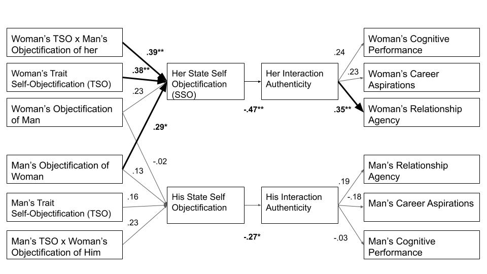

```{r setup, analysis-preferences}
# Seed for random number generation
set.seed(42)
knitr::opts_chunk$set(cache.extra = knitr::rand_seed, include = FALSE)
```

```{r packages, warning = FALSE, message = FALSE}
library(papaja)
library(nlme)
library(haven)
library(devtools)
library(psych)
library(mosaic)
#library(dyadr)
library(tidyr)
library(dplyr)
library(irr)
library(apaTables)
library(knitr)
library(kutils)
library(tidyverse)
library(lavaan)
library(xtable)
```
    
@robertsfredrickson Objectification Theory, suggests that women are objectified in interpersonal encounters, and that the effect might be strongest from men, but possibly also from women. Psychological researchers studying the sexual objectification of women, and the resulting self-objectification that follows, have in recent years explored the interpersonal process of the objectification - self-objectification link (CITE INTERPERSONAL PROCESS LINKS). For example, in a face-to-face mixed-gender dyadic study, @garcia2016objectification found that men's reported objectification of their female interaction partner during an interaction was associated with increased self-objectification reported by their partner. @gervais2020social has reviewed the literature on interpersonal self-objectification and has organized the the process in a theoretical model called the SIMO, but this model is only relevant for mixed-gender encounters. Although there is ample evidence that women objectify other women [@loughnan2015exploring; @puvia2013being], there is currently no studies investigating the process of interpersonal objectification same-gender interactions. Does objectification by a female interaction partner have the same downstream negative consequences as being objectified by a male interaction partner? For example, perhaps women could be amplifying each others' self-objectification as they get ready to go out for the night, *before* the theoretical encounters with men outlined in @gervais2020social occur. 

##Self-Objectification
Self-objectification is a multidimensional process that accounts for the cognitive mechanism that translates experiences of sexualization at the cultural level [@loughnan2015exploring] to psychological (e.g., anxiety, self-esteem, authenticity, motivational states) and behavioral (cognitive performance, body monitoring) features of mental health and well-being at the individual level [@calogero2011; @moradi2008]. @calogero2011 proposes that the construct of self-objectification can be conceptualized as a learned trait. Furthermore, it can also be elicited momentarily, through the media, for example, with sexualized images in movies and magazines [@morry2001magazine], which can lead to a state of self-objectification [@bernard2018bodies; @calogero2011; @moradi2008]. Being objectified by another person and possessing trait-level self-objectification (TSO) may interact to influence experiences of feeling like a body, or state self-objectification (SSO) [@fredrickson1998swimsuit, @garcia2016objectification]. Does this habit self-objectification lead women to also objectify other women, possibly to compare oneself? 

##Women Objectifying Women
Past research has focused on men’s objectifying behaviors, with little attention to the role that women may also play in enacting objectification of women. @hill2008examining assessed women’s experiences of objectification from men separately from women’s experiences of objectification from women and found that women may be socialized not only to see themselves as objects but perhaps to see other women as objects as well (THEY DIDN'T DETERMINE THIS IN PERSON).
Some studies have found that women objectify other women to a greater extent than they objectify men [@loughnan2015exploring]. Women objectify (dehumanized) sexualized targets presented as images [@puvia2013being], but we know next to nothing about interpersonal sexual objectification among women and what the immediate effects might be. Further, do women objectify non-sexualized women they are interacting with? What might be different for same-gender interactions? @harsey2020men found that self-objectification was related to the objectification of women to a similar degree for men and women participants, although men scored high than women on a measure of belief that objectification of women is natural for men. ASK RANDI-WE KNOW OBJECTIFICATION HAS MORE ADVERSE CONSEQUENCES FOR WOMEN THAN MEN (Gervais, Vescio, & Allen, 2011; Moradi & Huang, 2008; Saguy, Quinn, Dovidio, & Pratto, 2010)...MENTION THAT...HOWEVER DOES WOMEN OBJECT WOMEN TO A GREATER EXTENT THAN MEN MATTER MORE?...STILL TRYING TO FIGURE THAT OUT? ADDITIONALLY @strelan2005women FOUND THAT THE MORE WOMEN SELF-OBJECTIFY, THE MORE THEY OBJECTIFY OTHER WOMEN.

##Interpersonal Objectification
SIMO model and literature review [@gervais2020social]. Studies have shown that within social encounters women are gazed at more than men [@briton1995], often times feel ‘looked at’ within interpersonal interactions [@argyle1969; @miles2015stop], and will more than likely internalize the objectifying gaze on physical self [@puvia2013being; @young1979]. Moreover, perhaps the most adverse effect of objectifying treatment is that it effectively socializes girls and women to treat themselves as objects to be looked at and evaluated, an effect termed self-objectification  [@Bartky; @berger1972; @fredrickson1998swimsuit]. We don't know about women-on-women interpersonal objectification. What might be different?

Self-objectification has been found to occur after a mere relationship prime among women [@sanchez2008romance] because in our culture women need to look attractive to obtain and maintain successful relationship, thus, the "college relationships condition may heighten self-objectification and the evaluation of other women in a sexualized way. Among heterosexual male and female college students, self- objectification has been found to be positively associated with the extent to which they objectify their romantic partners [@zurbriggen2011self]. Researchers have also studied interpersonal objectification and self-objectification in romantic relationships [@strelan2018birds]. Evidence is mixed, and women can sometimes have positive outcomes from appearance valuation within the context of an established romantic relationship and they experience less SSO after appearance comments within romantic relationships [@meltzer2020women], less is known about first dates. But this literature is also only about heterosexual relationships. A recent study has investigated the effect of self-objectification on the reduction of relationship building skills in general (including same-sex friendships) [CITE PWQ paper I reviewed, Yoder editor]. Empirical evidence reveals that objectification manifests through inauthenticity in romantic relationships [@brunelletal2010], adverse attitudes in regard to career aspirations, and a decrease in concentration and impairment in female cognitive performance [@kahalon2018don; @quinnetal]. Both romantic relationships and relationships in general have been studies in the context of objectification, but neither of these literatures have investigated specifically same-gender relationships.

There is evidence that the experience of state self-objectification in mixed-gender contexts (stranger and romantic) and within the self in any moment (trying on a swimsuit) has negative consequences, but what about in the context of interaction with other women? Is the self-objectification experience in mixed-gender interactions the same as that experienced in same-gender interactions? The ample research demonstrating that the male gaze has a particularly detrimental effect would suggest no [@saguyetal2010, @calogero2004test; @gervais2011you; @gay2010my]. Women do objectify other women [@puvia2013being; @loughnan2015exploring; @harsey2020men], but when they do it, does it lead to self-objectification in the same way men's objectification of women does [@garcia2016objectification]? If so, does the self-objectification experienced in these same-gender interactions have the same negative consequences for authenticity in that interaction?  

##Interpersonal Objectification and Authenticity
There is some evidence that reduced authenticity is a consequence of self-objectification in the moment [@garcia2016objectification; again CITE PWQ paper I reviewed, Yoder editor]. This link has been justified by the literature on stigmatized-stigmatizer interactions (CITE LITERATURE DIDN'T COME ACROSS THIS), viewing the experience of being objectified in an interaction as an identity threat situation (MAYBE CITE MILES-MCLEAN PAPER "STOP LOOKING AT ME!"). When a woman is objectified by a man, and then experiences self-objectification, this intergroup encounter might trigger identitiy threat, but is the same negative consequence present when a woman is objectified by another woman? woman-woman interpersonal objectification processes might diverge from this process. One the one hand, she may not be having the same negative consequences the cascade from situations that threated group-based identity [@deaux1987putting; @dovidio2006nonverbal; @hebl2005promoting], but feeling like a body, rather than a full human, in an interaction may be enough to reduce feelings of authenticity and social competence, regardless of the gender of the objectifyer [@tolman2006looking; PWQ paper I reviewed, Yoder editor]. I DONT KNOW WHERE THIS PAPER IS? ASK RANDI ABOUT IDENTITY_THREAT PAPERS 

##The Current Study
In the current study, we sought to examine what occurs during an interaction in which one or both partners are objectifying each other, similarly to @garcia2016objectification,  but between same-sex female interpersonal interactions. Moreover, the current study uses a face-to-face interaction paradigm and dyadic data analysis techniques to examine the effects for both women simultaneously. We expected to replicate the results found in @garcia2016objectification. We predicted that being objectified by one’s interaction partner would lead to self-objectification, which in turn would lead to feelings of inauthenticity, then reduced feelings of agency in romantic relationships, reduced career aspiration, and reduced cognitive performance. Specifically, we expected to find a positive relationship between other-objectification by one's partner and state self-objectification. We also expect to find a negative relationship between self-state objectification and interaction authenticity, and that interaction authenticity will be positively related to cognitive performance, relationship agency, and career aspirations.

@puvia2013being would alternatively predict that women's tendency to self-objectify (TSO) leads them to objectify other women (...well, dehumanize a sexualized woman, but also @strelan2005women would predict the TSO->SOO link and @harsey2020men too), and this is mediated by the woman's own state self-objectification (SSO). So we also tested this as a possible alternative model.

# Methods

##Procedure
The procedure used was identical to that in @garcia2016objectification, except for the instructions that the participants were given. In brief, that methodology is that each participant arrived at the laboratory and were then led into separate cubicles to prevent any communication between the participants before the interaction. In addition, each participant was screened for prior acquaintance to confirm that they had not met prior to the study. They were asked to sign the consent form to participate, and the study was described as follows: “This is a study looking at how students form different types of relationships at college.” A prompt on the computer screen told the participants that they were assigned to the “College Relationships” condition and gave the following instructions:

>There are many types of relationships people form in college. During the interaction, please think about your partner's potential as a romantic partner. Even if they are not the gender you are attracted to, you can still judge their potential as a romantic partner. After the interaction you will be asked to evaluate how dateable your partner is. In other words, we would like to know if you think someone would date your interaction partner. Also, your interaction partner will be evaluating you in the same manner. 

The decision was made to ask even heterosexual women to judge their women partners as potential romantic partners. We felt that this prompt would keep the study closest to a replication of the previous @garcia2016objectification version of the study. Past research has found that women, largely due to an increase self-objectifying state, are indeed able to evaluate other women's potential as romantic partners--indeed, women may be unfortunately used to thinking this way about themselves, and we suspect other women. 

Two participants were then brought into a larger interaction room where they sat on stools prearranged to be 36 inches apart. The experimenter instructed the participants to “get to know each other” for 10 minutes and then left the room. After 10 minutes, the experimenter came back into the room and stopped the interaction. The participants then went back to their individual cubicles and completed a set of post-interaction measures. Participants were then thanked for their participation and debriefed @garcia2016objectification. The full methodology used is found in @garcia2016objectification’s study.

##Combined Samples

```{r data}
clark_final <- read.csv("Cleaned data/clark_final.csv")
smith_final <- read.csv("Cleaned data/smith_final.csv")
clarksmith_women <- read.csv("Cleaned data/clarksmith_women.csv")
```

```{r}
ns <- clarksmith_women %>%
  group_by(smith_or_clark) %>%
  summarise(n = n()) %>%
  as.matrix() %>% as.numeric()
```

Data from two different, but demographically equivalent, samples were combined to create the final analysis sample (*N =* `r nrow(clarksmith_women)`) used in this study. In the measures section that follows we refer to them as Sample 1 and Sample 2. Sample 1 (*N =* `r ns[3]`) is from a co-ed liberal arts college in the northeast US and Sample 2 (*N =* `r ns[4]`) is from a women’s liberal arts college in the northeast US. The description of the samples section below contains more detail about equivalence analyses to support the decision to combine these two samples. 

##Post interaction Measures

```{r correaltions}
#NOT SURE WHAT THIS CHUNK WAS FOR BUT ITS NOT NEEDED

# clarksmith_correlations <- clarksmith_women %>%
#   select(TSO_A, authenticity_A, a2pSOO_A, howbody_avg_A, 
#          relag_A, careerasp_A,  trigram_score_A, TSO_P, 
#          authenticity_P, a2pSOO_P, howbody_avg_P, 
#          relag_P, careerasp_P, trigram_score_P)
# 
# #Correlation tables
# correlations <- apa.cor.table(clarksmith_correlations, table.number=1)
```

```{r corrtable, include=TRUE, echo=FALSE, results='asis'}
#Table 1
glrstab<- function(x, export=FALSE) {
 
 r <-corr.test(x)$r	#taking just the correlation matrix; no N, or p
 p <-corr.test(x)$p	#taking the p*s
 
#define notions for significance levels
 mystars <- ifelse(p < .001, "**"
                   , ifelse(p < .01, "**"
                            , ifelse(p < .05, "*"
                                     , ifelse(p < .10, "+", " "))))
 
 #round r, define new matrix Rnew with the correlations from rnd and paste mystars
 rnd  <- papaja::printnum(r, gt1 = FALSE, digits = 2)  #round, drop leading 0 - Thanks CRSH!								                     
 Rnew <- matrix(paste(rnd, mystars, sep=""), ncol=ncol(rnd)) 
 
#remove 1.0 correlations from diagonal and set the strings
 diag(Rnew) <- ''		
 Rnew[upper.tri(Rnew)] <- ''								                	
 
 rownames(Rnew) <- paste(1:ncol(rnd), colnames(rnd), sep=" ")         #define number and name
 colnames(Rnew) <- paste(1:ncol(rnd), "", sep="") 			       #define number
 
#fun-part: we trim the top half 
 Rnew[upper.tri(Rnew)] <- ''			
 Rnew
 
 Rnew <- cbind(round(describe(x)[,3:4],2), Rnew)		 #describe x, M sD - put them in the matrix
 colnames(Rnew)[1:2] <- c("M","SD")			#Beschriftung der neuen Spalten-"labeling of the new columns"
 Rnew <- Rnew[,1:(ncol(Rnew)-1)]							   	#delete the last column (ugly)
 
 #export to clipboard
 
   if (export==TRUE){
   result<-write.table(Rnew
                       , "clipboard"
                       , sep=";"
                       , row.names=FALSE)
 }
 else result <- Rnew
 return(result)
 
}

corr_cswomen <- clarksmith_women %>%
  select(TSO_A, authenticity_A, a2pSOO_A, howbody_avg_A, relag_A, trigram_score_A)

corr.table <- glrstab(corr_cswomen)
rownames(corr.table) <- c("Actor's trait self objectification (TSO)", "Actor's authenticity of interaction", "Actor's objectification of partner", "Actor's state self-objectification", "Actor's future relationship agency", "Actor's cognitive performance")
colnames(corr.table)   <- c("$M$", "$SD$", "1", "2", "3", "4", "5")

apa_table(corr.table, caption="Correlations among study variables.", escape=FALSE)
```

```{r descriptives, include=TRUE, echo=FALSE, results='asis'}
#table 2
descriptives_cswomen <- clarksmith_women %>%
  select(TSO_A, authenticity_A, a2pSOO_A, howbody_avg_A, relag_A, trigram_score_A)
descriptives <- describe(descriptives_cswomen)

descriptives <- descriptives %>%
  select(mean, sd)

rownames(descriptives) <- c("Actor's trait self objectification (TSO)", 
                            "Actor's authenticity of interaction", 
                            "Actor's objectification of partner", 
                            "Actor's state self-objectification", 
                            "Actor's future relationship agency", 
                            "Actor's cognitive performance")

colnames(descriptives) <- c("M", "SD")

apa_table(descriptives, caption = "Descriptive Statistics for Study Variables")
```

The following measures were collected in the order they are presented following the interaction. Correlations appear in Table\ \@ref(tab:corrtable), and descriptive statistics appear in Table\ \@ref(tab:descriptives). 

###Cognitive Performance
```{r trigram}
#Cognitive performance - Full sample
mean_trigram <- favstats(~trigram_score_A, data=clarksmith_women)$mean
sd_trigram <- favstats(~trigram_score_A, data=clarksmith_women)$sd
```

Trigrams from the Remote Associates Task [@mcfarlin1984remote] were utilized to assess cognitive performance after the interaction. Ten items were selected and presented to participants. For example, the correct answer for the trigram “Quack: Pond: Waddle” would be “Duck”. Participants are limited to 30 seconds. For every correct answer, 1 point is given. The mean score was `r mean_trigram` (SD = `r sd_trigram`). Cognitive performance was measured first in order to measure potential immediate detriments to performance [@garcia2016objectification].

###State Other-Objectification
```{r alpha_SOO}
##SOO
#Clark
clark_extsoo_alpha <- psych::alpha(select(clark_final, otherint_1, otherint_2, 
                                          otherint_5, otherint_6, otherint_10))$total[2]
clark_intsoo_alpha <- psych::alpha(select(clark_final, otherint_3, otherint_4, 
                                          otherint_7, otherint_8, otherint_9, otherint_11, 
                                          otherint_12))$total[2]
#Smith
smith_extsoo_alpha <- psych::alpha(select(smith_final, otherint_1, otherint_2, otherint_5, 
                                          otherint_6, otherint_10))$total[2]
smith_intsoo_alpha <- psych::alpha(select(smith_final, otherint_3, otherint_4, otherint_7, 
                                          otherint_8, otherint_9, otherint_11, otherint_12))$total[2]

descsplit <- clarksmith_women %>%
  group_by(sexor_A == 1) %>%
  summarize(mean_soo = mean(a2pSOO_A, na.rm = TRUE),
            sd_soo = sd(a2pSOO_A, na.rm = TRUE))

soo_diff <- t.test(a2pSOO_A ~ (sexor_A == 1), data = clarksmith_women)
```
To measure the participant’s objectification of their partner in the interaction, participants were asked a series of questions about the frequency of thoughts in relation to  multiple characteristics of their partner @garcia2016objectification. Questions included aspects of their partner’s internal traits such as personality, friends, family, and extracurricular interests, as well as external traits such as body, appearance, clothing, and body parts. All questions were to be rated on a scale from 1 (not at all) to 7 (constantly). Objectification was measured by getting the difference between the average frequency of thought about their partner’s external traits ($\alpha$ = `r printnum(clark_extsoo_alpha)[1,1]` for Sample 1, $\alpha$ = `r printnum(smith_intsoo_alpha)[1,1]` for Sample 2) and frequency of thought about their partner’s internal traits ($\alpha$ = `r printnum(clark_extsoo_alpha)[1,1]` for Sample 1, $\alpha$ = `r printnum(smith_extsoo_alpha)[1,1]` for Sample 2). A positive score in this scale would indicate that the participant thought about their partner’s external traits more than the partner’s internal traits, and a negative score would indicate the opposite. 

As can be seen in Table\ \@ref(tab:descriptives), the mean other-objectification of women by women was *M =* `r descriptives[3,1]` (*SD =* `r descriptives[3,2]`). This corresponds to women objectifying other women to a *greater* extent than women's objectification of men reported in @garcia2016objectification (*M =* -1.68, *SD =* 1.52). Further, in the current sample the difference in other-objectification between heterosexual (*M =* `r round(as.numeric(descsplit[2,2]),2)`, *SD =* `r round(as.numeric(descsplit[2,3]),2)`) and non-heterosexual women (*M =* `r round(as.numeric(descsplit[1,2]),2)`, *SD =* `r round(as.numeric(descsplit[1,3]),2)`) was not statistically significant, *t*(`r round(soo_diff$parameter,2)`) = `r round(soo_diff$statistic, 2)`, *p =* `r round(soo_diff$p.value,3)`. 

###Interaction Authenticity
```{r alpha_intauth}
##Interaction Authenticity
#Clark
clark_intauth_alpha <- psych::alpha(select(clark_final, inter_1, inter_3, inter_5, 
                                           inter_6, inter_7, inter_9, inter_10, interaux_5, 
                                           interaux_6))$total[2]
#Smith
smith_intauth_alpha <- psych::alpha(select(smith_final, inter_1, inter_3, inter_5, inter_6, 
                                           inter_7, inter_9, inter_10, interaux_5, 
                                           interaux_6))$total[2]
```
To assess the magnitude to which individuals felt comfortable in the interaction and perceived the interaction to be authentic, we asked participants to rate the extent to which they felt comfortable, happy, friendly, warm, easygoing, sincere, and authentic on a scale ranging from 1 (not at all) to 7 (very much), much alike [@garcia2016objectification]. Participants were additionally asked to rate their interaction partner’s authenticity as well as their own: ‘‘Do you think your partner was authentic during your interaction?’’ and ‘‘Were you authentic during your interaction?’’ These questions were ranked on a scale from 1 (not authentic at all). These were combined to form the authenticity scale ($\alpha$ = `r printnum(clark_intauth_alpha)[1,1]` for Sample 1, $\alpha$ = `r printnum(smith_intauth_alpha)[1,1]` for Sample 2). 	

###State Self-Objectification
```{r alpha_SSO}
##SSO
#Clark - two items
clark_howbody_alpha<- psych::alpha(select(clark_final, howbody_1, howbody_2))$total[2]
#Smith - two items
smith_howbody_alpha <- psych::alpha(select(smith_final,  howbody_1, howbody_2))$total[2]
#Clark - three items
clark_howbody3 <- psych::alpha(select(clark_final, howbody_1, howbody_2, howbody_3))
#Smith - three items
smith_howbody3 <- psych::alpha(select(smith_final, howbody_1, howbody_2, howbody_3))
```
To assess state self-objectification, we used an average of two items from @saguyetal2010 that were also used in @garcia2016objectification. Participants were asked to rank how much they agreed with the following statements: “During the interaction I felt more like a body than a full self” and “I felt more like a body than as a real person in the interaction”. Originally, @saguyetal2010 used 3 items, but in both samples the reliability of the scale was higher once the third item was removed, so we chose to only use the first two for our measure of SSO, leaving us with a reliable scale ($\alpha$ = `r printnum(clark_howbody_alpha)[1,1]` for Sample 1, and $\alpha$ = `r printnum(smith_howbody_alpha)[1,1]` for Sample 2.)

###Relationship Agency
```{r alpha_relagen}
##Relationship Agency
#Clark
clark_relag_alpha <- psych::alpha(select(clark_final, relag_1, relag_2, relag_3, 
                                         relag_4, relag_5, relag_6, relag_7, relag_8, 
                                         relag_9.r))$total[2]
#Smith
smith_relag_alpha <- psych::alpha(select(smith_final, relag_1, relag_2, relag_3, relag_4, 
                                         relag_5, relag_6, relag_7, relag_8, 
                                         relag_9.r))$total[2]

#corr.test(select(clark_final, relag_1, relag_2, relag_3, relag_4, relag_5, relag_6, relag_7, relag_8, relag_9.r))
#corr.test(select(smith_final, relag_1, relag_2, relag_3, relag_4, relag_5, relag_6, relag_7, relag_8, relag_9.r))
##DROPPING ITEM 9
clark_relag_alpha <- psych::alpha(select(clark_final, relag_1, relag_2, relag_3, 
                                         relag_4, relag_5, relag_6, relag_7, relag_8))$total[2]

smith_relag_alpha <- psych::alpha(select(smith_final, relag_1, relag_2, relag_3, relag_4, 
                                         relag_5, relag_6, relag_7, relag_8))$total[2]
```
A scale was used from @garcia2016objectification to assess how much agency an individual believes they would possess in future romantic relationships. Participants were asked how likely it was that they would do the following: ‘‘ask someone out on a date,’’ ‘‘open the door for your date,’’ ‘‘pay for a date,’’ ‘‘ask your boyfriend/girlfriend to marry you,’’ ‘‘initiate sex with your girlfriend/boyfriend,’’ ‘‘initiate condom use during sex,’’ ‘‘surprise your boyfriend/ girlfriend with a gift,’’ and ‘‘ask your girlfriend/boyfriend to move with you to a new place.’’ Responses were measured on a scale ranging from 1 (not at all likely) to 7 (extremely likely). The scale originally had 9 items, but the 9th item had low correlations with the remaining items, ranging from .02 to .30 for the first sample, and .04 to .30 for the second sample. The item was intended to be reverse coded, but correlations were still low enough to make the scale unreliable. Therefore, the ninth item was removed. As a result, the scale had moderately high reliability for both samples ($\alpha$ = `r printnum(clark_relag_alpha)[1,1]` for Sample 1, ($\alpha$ = `r printnum(smith_relag_alpha)[1,1]` for Sample 2).

###Career Aspirations
```{r alpha_career}
##Career Aspirations
#Clark
clark_final <- clark_final %>% #reverse code certain career aspiration variables
  mutate(careerasp4.r = (min(careerasp_4, na.rm = TRUE) + max(careerasp_4, na.rm = TRUE) - careerasp_4),
         careerasp7.r = (min(careerasp_7, na.rm = TRUE) + max(careerasp_7, na.rm = TRUE) - careerasp_7),
         careerasp10.r = (min(careerasp_10, na.rm = TRUE) + max(careerasp_10, na.rm = TRUE) - careerasp_10))

clark_careerasp_alpha <- psych::alpha(select(clark_final, careerasp_1, careerasp_2, 
                                             careerasp_3, careerasp4.r, careerasp_5, 
                                             careerasp_6, careerasp7.r, careerasp_8, 
                                             careerasp_9, careerasp10.r))$total[2]

#Smith
smith_final <- smith_final %>% #reverse code certain career aspiration variables
  mutate(careerasp4.r = (min(careerasp_4, na.rm = TRUE) + max(careerasp_4, na.rm = TRUE) - careerasp_4),
         careerasp7.r = (min(careerasp_7, na.rm = TRUE) + max(careerasp_7, na.rm = TRUE) - careerasp_7),
         careerasp10.r = (min(careerasp_10, na.rm = TRUE) + max(careerasp_10, na.rm = TRUE) - careerasp_10))

smith_careerasp_alpha <- psych::alpha(select(smith_final, careerasp_1, careerasp_2, 
                                             careerasp_3, careerasp4.r, careerasp_5, 
                                             careerasp_6, careerasp7.r, careerasp_8, 
                                             careerasp_9, careerasp10.r))$total[2]
```
To conceptualize participants’ career aspirations after the interaction, we used the 10-item adaptation of @grayobrien2007’s Career Aspiration Scale employed in @garcia2016objectification, which asked participants to consider how true 10 statements were in regard to their future careers on a scale from 0 (not at all true of me) to 4 (very true of me). Items include "I hope to become a leader in my career field" and "I hope to move up through any organization or business I work in." Items were fairly reliable ($\alpha$ = `r printnum(clark_careerasp_alpha)[1,1]` for Sample 1, $\alpha$ = `r printnum(smith_careerasp_alpha)[1,1]` for Sample 2).

###Trait Self-Objectification
```{r alpha_TSO}
###TSO
#Clark--external and internal
clark_funcTSO_alpha <- psych::alpha(select(clark_final, tso_1, tso_2, tso_4, tso_7, tso_9), check.keys=TRUE)$total[2]
clark_physTSO_alpha <- psych::alpha(select(clark_final, tso_3, tso_5, tso_6, tso_8, tso_10), check.keys=TRUE)$total[2]

#Smith--external and internal
smith_funcTSO_alpha <- psych::alpha(select(smith_final, tso_1, tso_2, tso_4, tso_7, tso_9), check.keys=TRUE)$total[2]
smith_physTSO_alpha <- psych::alpha(select(smith_final, tso_3, tso_5, tso_6, tso_8, tso_10), check.keys=TRUE)$total[2]
```
Trait self-objectification (TSO) was assessed using the Self-Objectification Questionnaire [@fredrickson1998swimsuit; @nollfredrickson1998], which evaluates the extent to which individuals view their bodies in observable versus non-observable ways. The questionnaire asked participants to rank order both appearance and functional aspects of their bodies, from 1 (least important) to 10 (most important), with respect to physical self-concepts. Of the ten body attributes, five of the items were appearance-based (weight, sex appeal, physical attractiveness, firm/sculpted muscles and body measurements), and five of the items were competence-based (strength, physical coordination, energy level, health and physical fitness). Difference scores were computed by subtracting the sum of the 5 functional aspects/competence attributes (e.g., health, strength) from the sum of the 5 physical self-concepts/appearance attributes (e.g., physical attractiveness, weight), and all measures were multiplied by -1, as was done in @garcia2016objectification, so that positive scores indicated greater TSO. 

###Description of the Samples
Thirty-two previously unacquainted self-identifying female-sex dyads (64 total participants) from two liberal arts institutions in the Northeast of the United States participated in this study.  More specifically, twelve of the pairs, which derived from Sample 1, were students at a co-ed liberal arts college, while the remaining twenty pairs who came from Sample 2 attended a women’s liberal arts college. Initially, data was collected from same-sex and mixed-sex dyads that comprised of male and female gendered individuals. Sample 1 originally consisted of twenty-two pairs, twelve men and thirty-two women. Twenty-three pairs made up of forty-three women and one man, as well as two participants who did not identify with either gender category, formed Sample 2. For consistency, we limited participant data to same sex female pairs at the two colleges.

```{r demographics}
#favstats(~TSO_A, data=clarksmith_women)
#favstats(~a2pSOO_A, data=clarksmith_women)
#favstats(~howbody_avg_A, data=clarksmith_women)
#favstats(~relag_A, data=clarksmith_women)
#favstats(~careerasp_A, data=clarksmith_women)
#favstats(~authenticity_A, data=clarksmith_women)
#favstats(~trigram_score_A, data=clarksmith_women)

#Mean and SD of age of sample
mean_age <- favstats(~age_A, data = clarksmith_women)$mean
sd_age <- favstats(~age_A, data = clarksmith_women)$sd
tally(clarksmith_women$race_A == clarksmith_women$race_P)

#Calculating race percentages
tally(~race_A, data = clarksmith_women)  #Note that we can add "format = percentage" and not need to calculate
percentage_black <- 6/(6+18+31+6+3)*100
percent_asian <- 18/(6+18+31+6+3)*100
percent_white <- 31/(6+18+31+6+3)*100
percent_latinx <- 6/(6+18+31+6+3)*100
percent_other <- 3/(6+18+31+6+3)*100
tally(~sexor_A, data=clarksmith_women)
percent_straight <-(41/64)*100
percent_queer <- (3+8+5)/64*100
tally(~gender_A, data=clarksmith_women)

table(clarksmith_women$race_A, clarksmith_women$race_P)
samerace_white <- 16/2 #divide by 2 since table is people, not pairs
samerace_minority <- (6+2)/2
mixedrace_white <- 2+10+2+1
mixedrace_minority <- 1+2+1+1

test <- clarksmith_women %>%
  filter(race_A==3, race_A!=race_P)

tally(~gender, data=clark_final)
tally(~gender, data=smith_final)
```

Due these similarities across samples in regard to correlation patterns between significant variables within this study, the two datasets were combined. These participants were mostly first-year college students, with an average age of `r mean_age` (SD = `r sd_age`). The sample was `r percent_white`% White/European American, `r percentage_black`% Black/African-American, `r percent_asian`% Asian/Pacific Islander, `r percent_latinx`% Latinx, and `r percent_other`% mixed-race. There were `r samerace_white` White/White pairs and `r samerace_minority` same race racial minority pairs, for a total of `r samerace_white + samerace_minority` same-race pairs. The remaining `r mixedrace_white + mixedrace_minority` were mixed race pairs, of which `r mixedrace_white` were White/racial minority pairings and `r mixedrace_minority` were cross-racial minority group pairs. `r percent_straight`% of the sample identified as heterosexual, and `r percent_queer`% identified as gay, lesbian or bisexual. 

# Results
## Data analysis
```{r create_r-references, warning=FALSE, message=FALSE}
#cite_r(file = "references.bib")
r_refs(file = "r-references.bib")
```
We used `r cite_r("r-references.bib")` for all our analyses.

## Analysis Strategy
```{r apim, include=TRUE, echo=FALSE, results='asis', out.width="400px", fig.cap="Basic actor-partner interdependence model (APIM) depiction."}
include_graphics("APIM_figure.png")
```

```{r 2016figure, include=TRUE, echo=FALSE, results='asis', out.width="400px", fig.cap="Path Analysis Model from Garcia et al. (2016) study with distinguishable dyads."}

```
This study sought to replicate the results of @garcia2016objectification’s study, done with male-female pairs, which used a dyadic path analysis to detect whether partners’ objectification of one another affected state self-objectification (SSO). See Figure\ \@ref(fig:2016figure) for the results of the analysis from this previous study. We hope to investigate how the central effects found in the previous study relate to interactions between two women. Specifically, we are interested in testing the relationship between state-other objectification and SSO, and how SSO in turn, affects feelings of inauthenticity during the interaction. In addition, we will also test if the effect of other-objectification in an interaction on SSO is only present for those women who are high in trait self-objectification, as in @garcia2016objectification. Further, we will investigate the relationships between experiencing interaction inauthenticity and relationship agency, career aspirations, and cognitive performance. 

While @garcia2016objectification used dyadic path analysis, we will conduct our dyadic analyses using multilevel modeling. Dyadic analyses for distinguishable dyads (e.g., mixed-gender interacting pairs) is more natural in Structural Equation Modeling (SEM) than it is for indistinguishable dayds (e.g., same-gender interacting pairs) [@ledermann2017analyzing; @garcia2015moderation]. One reason for this asymmetry is that, due to the arbitrary distinctions made between "partner 1" and "partner 2" in indistinguishable dyads, many estimates need to be fixed to be equal (i.e., paths, variances, covariances, endogenous intercepts, and exogenous means) for indistinguishable dyads but these equality constraints should not then be considered in the degrees of freedom calculations for fit estimations [@olsen2006structural]. Further, @olsen2006structural detail how a new independence model and the corresponding fit measure should be re-calculated for indistinguishable dyads models. The current study uses dyadic multilevel modeling (MLM) to test all relationships and mediation patterns. The online supplementary materials contains analysis using SEM. See @ledermann2017analyzing for a more complete discussion of the considerations for using SEM versus MLM for dyadic analysis.  

Testing the @garcia2016objectification model on the current, same-gender, sample, involves using the Actor-Partner Independence Model (APIM) approach for each outcome variable (i.e., endogenous variable in Figure\ \@ref(fig:2016figure)). Thus, we ran five APIM's to test all the hypothesized relationships. See Figure\ \@ref(fig:apim) for a basic APIM model. The APIM includes effects due to one's own, as well as one's partner's, predictor variables ($X$'s) on the one's own outcome variable ($Y$). Unlike the original @garcia2016objectification study, our study deals with indistinguishable dyads, meaning the designation of who is designated as "actor" and who is designated as "partner" is arbitrary. Recall that the indistinguishable nature of the dyads in the current study led us to choose the MLM approach over SEM. These analyses are considered exploratory, given the lack of prior research theorizing about these linkages.

Before moving to the main analyses, we discuss statistical equivalence test that provide support for combining Sample 1 and Sample 2 in one analysis sample. The online supplemental material contains the main analyses separated by samples. All results presented below are from models including sample as a control variable.

<!-- The model differences as a result of adopting this MLM approach include an examination of the partner effect of TSO on SSO, partner effect of SSO on authenticity, and partner effects of authenticity on congitive performance, relationship agency, and career aspirations.  -->

<!-- We used path analysis to obtain our estimates, but because our sample is nonindependent, we used the indistinguishable actor–partner interdependence model [@olsen2006structural]. The APIM can be defined as a "model of dyadic relationships that integrates a conceptual view of interdependence with the appropriate statistical techniques for measuring and testing it" [@olsen2006structural]. Due to the complexity of the original @garcia2016objectification study, we also had to set the exogenous covariances equal. More specifically, the covariances between TSO, actor and partner objectification, and the interaction between actor TSO and partner objectification (and vice versa). -->

<!-- In order to interpret model fit, which refers to the ability of a model to reproduce the data (i.e., usually the varience-covariance matrix) we utilized both the I-SAT (saturated) model, and the Null model to ensure that all possible corresponding covariences are fixed to be equal across partners. We obtained fit estimates by subtracting the chi-square estimate for the I-SAT model from the analysis model [@olsen2006structural, @peugh2013analyzing]. -->

### Combining Samples
```{r}
##Correlations
round(corr.test(select(filter(clarksmith_women, smith_or_clark == "Smith"), 
                 a2pSOO_A, a2pSOO_P, TSO_A,
                 howbody_avg_A,
                 authenticity_A, 
                 trigram_score_A, careerasp_A, relag_A))$r, 3)

round(corr.test(select(filter(clarksmith_women, smith_or_clark == "Clark"), 
                 a2pSOO_A, a2pSOO_P, TSO_A, 
                 howbody_avg_A,
                 authenticity_A, 
                 trigram_score_A, careerasp_A, relag_A))$r, 3)
```
The correlations between study variables is similar across samples. The reliabilities for the study scales were also equivalent. (Note that the two samples were two small to conduct formal measurement equivalence tests for scales.) There are no statistically significant differences between samples in demographics including age, STATS, and ethnicity, STATS.

##Main Results
```{r semfigure, include=TRUE, echo=FALSE, results='asis', out.width="400px", fig.cap="Path Analysis Model with Estimates"}
include_graphics("SEMfigure.png")
```

```{r mlm, include=TRUE, results='asis'}
# fit_table <- xtable(parameterEstimates(fit))
# 
# fit_table <- fit_table %>%
#   filter(op=="~") %>%
#   mutate(lhs = ifelse(lhs == "howbody_avg_A", "Actor SSO",
#                       ifelse(lhs=="authenticity_A", "Actor Authenticity",
#                              ifelse(lhs=="howbody_avg_P", "Partner SSO",
#                                     ifelse(lhs=="authenticity_P", "Partner Authenticity",
#                                            ifelse(lhs=="relag_A", "Actor Rel. Agency",
#                                                   ifelse(lhs=="relag_P", "Partner Rel. Agency",
#                                                          ifelse(lhs=="careerasp_A", "Actor Career Aspirations",
#                                                                 ifelse(lhs=="careerasp_P", "Partner Career Aspirations",
#                                                                        ifelse(lhs=="trigram_score_A", "Actor Cog. Performance",
#                                                                               ifelse(lhs=="trigram_score_P", "Partner Cog. Performance", NA)))))))))),
#          rhs = ifelse(rhs=="TSO_A", "Actor TSO",
#                       ifelse(rhs=="a2pSOO_A", "Actor Obj. of Partner",
#                              ifelse(rhs=="a2pSOO_P", "Partner Obj. of Actor",
#                                     ifelse(rhs=="TSO_A_SOO_P", "Actor TSO x Partner Obj.",
#                                            ifelse(rhs == "howbody_avg_A", "Actor SSO",
#                                                   ifelse(rhs=="howbody_avg_P", "Partner SSO",
#                                                          ifelse(rhs=="TSO_P", "Partner TSO",
#                                                                 ifelse(rhs=="TSO_P_SOO_A", "Partner TSO x Actor Obj.",
#                                                                        ifelse(rhs=="authenticity_A", "Actor Authenticity",
#                                                                               ifelse(rhs=="authenticity_P", "Partner Authenticity", NA))))))))))) %>%
#   select(lhs, op, rhs, est, se, z, pvalue) %>%
#   #taking out partner-partner estimates
#   slice(1:5,11:13)
# 
# colnames(fit_table) <- c("Path", "", "", "Estimate", "SE", "z-value", "p-value")
# 
# apa_table(fit_table, caption = "Estimates from final Path Analysis Model", font_size = "small")
```

```{r presentation-functions}
 pround <- function(val){
  ifelse(val < .001,
         return(sub("^(-?)0.", "\\1.", sprintf("%.3f", .001))),
         return(sub("^(-?)0.", "\\1.", sprintf("%.3f", val))))
}

estround <- function(val){
  ifelse(abs(val) < .01,
         return(.01),
         return(round(val, 2)))
}

#only works for merModlmerTest objects or when p-values on are in column 4, "lm" objects
report_stats <- function(mod, est){

  b <- coef(summary(mod))[,1]
  se <- coef(summary(mod))[,2]
  ifelse(class(mod) == "merModLmerTest",
         p <- coef(summary(mod))[,5],
         p <- coef(summary(mod))[,4])

  paste(ifelse(abs(b[est]) < .01,"*b* < ","*b* = "), as.character(estround(b[est])),
        ifelse(se[est] < .01, ", *SE* < ", ", *SE* = "), as.character(estround(se[est])),
        ifelse(p[est] < .001, ", *p* < ", ", *p* = "),  as.character(pround(p[est])),
        sep = "") %>%
    return()
}
# randomeffects <- as.data.frame(VarCorr(mlm_mod1.0))
# randomeffects2 <- as.data.frame(VarCorr(mlm_mod2.0))
```


All model estimates and p-values are found in Table\ \@ref(tab:mlm) and the relationships with estimates included are depicted in Figure\ \@ref(fig:semfigure). 

```{r}
# apim0 <- gls(a2pSOO_A ~ TSO_A, 
#                  na.action=na.omit, 
#                  correlation=corCompSymm (form=~1|dyadID),
#                  data=clarksmith_women)
# summary(apim0)

#SSO
apim1 <- gls(howbody_avg_A ~ a2pSOO_A + a2pSOO_P + TSO_A + a2pSOO_P*TSO_A + smith_or_clark, 
                 na.action=na.omit, 
                 correlation=corCompSymm (form=~1|dyadID),
                 data=clarksmith_women)

apim1.b <- gls(howbody_avg_A ~ a2pSOO_A + a2pSOO_P + TSO_A + smith_or_clark, 
                 na.action=na.omit, 
                 correlation=corCompSymm (form=~1|dyadID),
                 data=clarksmith_women)

summary(apim1)
summary(apim1.b)
```
The most important finding from @garcia2016objectification was the significant partner effect of other objectification and SSO (specifically men's objectification of women and women's SSO). As expected, the partner effect of other-objectification on SSO in the current all-women sample was statistically significant, `r report_stats(apim1, 3)`, replicating @garcia2016objectification's finding. One's own other objectification had no effect on SSO, `r report_stats(apim1, 2)`. Contrary to past finding however, there was no statistically significant interaction of partner's other objectification and the person's trait self-objectification on SSO, `r report_stats(apim1, 5)`. There was also no significant main effect of trait self-objectification on SSO `r report_stats(apim1.b, 4)`.

```{r}
#authenticity
apim2 <- gls(authenticity_A ~ howbody_avg_A + smith_or_clark, 
                 na.action=na.omit, 
                 correlation=corCompSymm (form=~1|dyadID),
                 data=clarksmith_women)

summary(apim2)

#correlations between howbody and each authenticity item individually. 
min_corr <- min(abs(round(corr.test(select(clarksmith_women, 
                 howbody_avg_A, inter_1_A, inter_3_A, inter_5_A, 
                 inter_6_A, inter_7_A, inter_9_A, inter_10_A, 
                 interaux_5_A, interaux_6_A))$r, 3)[,1]))
max_corr <- as.numeric(sort(abs(round(corr.test(select(clarksmith_women, 
                 howbody_avg_A, inter_1_A, inter_3_A, inter_5_A, 
                 inter_6_A, inter_7_A, inter_9_A, inter_10_A, 
                 interaux_5_A, interaux_6_A))$r, 3)[,1]), decreasing = T)[2])

apim2.b <- gls(authenticity_A ~ howbody_avg_A + a2pSOO_P + smith_or_clark, 
                 na.action=na.omit, 
                 correlation=corCompSymm (form=~1|dyadID),
                 data=clarksmith_women)

summary(apim2.b)

apim2.c <- gls(authenticity_A ~a2pSOO_P + smith_or_clark, 
                 na.action=na.omit, 
                 correlation=corCompSymm (form=~1|dyadID),
                 data=clarksmith_women)

summary(apim2.c)
```
Contrary to expectations, there was no significant effect of SSO on interaction authenticity, although the estimate of this effect was in the hypothesized negative direction, `r report_stats(apim2, 2)`. Because authenticity was a composite score of 9 items, two of which were interaction specific authenticity items, we also estimated the pairwise correlations between SSO and all these items individually. They were all small, ranging from only `r -1*min_corr` to `r -1*max_corr`. Although we hypothesized that SSO would mediate the relationship between partner's other objectification and interaction authenticity, after finding no relationship between SSO and authenticity, we also tested if the partner's other objectification had a direct effect on authenticity, but this effect was not significant, `r report_stats(apim2.b, 3)` (nor was the total effect of partner's other objectification on authenticity, `r report_stats(apim2.c, 2)`).

```{r}
#cognitive performance
apim3 <- gls(trigram_score_A ~ authenticity_A + smith_or_clark, 
                 na.action=na.omit, 
                 correlation=corCompSymm (form=~1|dyadID),
                 data=clarksmith_women)

summary(apim3)

apim3.b <- gls(trigram_score_A ~ authenticity_A + howbody_avg_A + smith_or_clark, 
                 na.action=na.omit, 
                 correlation=corCompSymm (form=~1|dyadID),
                 data=clarksmith_women)

summary(apim3.b)

apim3.c <- gls(trigram_score_A ~ authenticity_A + howbody_avg_A + a2pSOO_P + smith_or_clark, 
                 na.action=na.omit, 
                 correlation=corCompSymm (form=~1|dyadID),
                 data=clarksmith_women)

summary(apim3.c)
```

```{r}
#relationship agency
apim4 <- gls(relag_A ~ authenticity_A + smith_or_clark, 
                 na.action=na.omit, 
                 correlation=corCompSymm (form=~1|dyadID),
                 data=clarksmith_women)

summary(apim4)

apim4.b <- gls(relag_A ~ authenticity_A + howbody_avg_A + smith_or_clark, 
                 na.action=na.omit, 
                 correlation=corCompSymm (form=~1|dyadID),
                 data=clarksmith_women)

summary(apim4.b)

apim4.c <- gls(relag_A ~ authenticity_A + howbody_avg_A + a2pSOO_P + smith_or_clark, 
                 na.action=na.omit, 
                 correlation=corCompSymm (form=~1|dyadID),
                 data=clarksmith_women)

summary(apim4.c)
```

```{r}
#career aspirations
apim5 <- gls(careerasp_A ~ authenticity_A + smith_or_clark, 
                 na.action=na.omit, 
                 correlation=corCompSymm (form=~1|dyadID),
                 data=clarksmith_women)

summary(apim5)

apim5.b <- gls(careerasp_A ~ authenticity_A + howbody_avg_A + smith_or_clark, 
                 na.action=na.omit, 
                 correlation=corCompSymm (form=~1|dyadID),
                 data=clarksmith_women)

summary(apim5.b)

apim5.c <- gls(careerasp_A ~ authenticity_A + howbody_avg_A + a2pSOO_P + smith_or_clark, 
                 na.action=na.omit, 
                 correlation=corCompSymm (form=~1|dyadID),
                 data=clarksmith_women)

summary(apim5.c)
```
Lastly, although there was no evidence that SSO was related to interaction authenticity in the current sample, we tested if interaction authenticity (composite of nine items) had effects on cognitive performance, career aspirations, and relationship agency, as it did in @garcia2016objectification. We again used MLM and thus, these effects were tested in three separate models. There was no significant effect of interaction authenticity on cognitive performance, `r report_stats(apim3, 2)`, but authenticity was significantly positively related to both career aspirations, `r report_stats(apim5, 2)`, and relationships agency, `r report_stats(apim4, 2)`. There was no direct effect of SSO on cognitive performance, `r report_stats(apim3.b, 3)`, and no direct effect of partner's other objectification on cognitive performance, `r report_stats(apim3.c, 4)`. There was no direct effect of SSO on career aspirations, `r report_stats(apim5.b, 3)`, and no direct effect of partner's other objectification on career aspirations, `r report_stats(apim5.c, 4)`. There was no direct effect of SSO on relationship agency, `r report_stats(apim4.b, 3)`, and no direct effect of partner's other objectification on relationship agency, `r report_stats(apim4.c, 4)`. 

The results were similar for analyses conducted on Sample 1 and Sample 2 individually. See the online supplemental material for more detail on these analyses. 

#Discussion

As stated previously, we did not find a significant effect between actor SSO and actor authenticity, which suggests that there is not sufficient evidence to support the claim that partner objectification is the cause for the diverse range of negative effects related to relationship inauthenticity. However, we did observe a significant partner effect of objectification on actor self-objectification, which does align with our hypothesis that theorized objectification from other women can also cause women to self-objectify just as they do within interactions between male-female pairs. 

##Sexism and Sexual Discrimination
Sexism has recently been found to be related to the objectification of women, but not men, for both men and women [@harsey2020men]. Empirical evidence illustrates how women continue to be objects of interpersonal discrimination and experience daily sexist hassles [@swimetal]. One form of interpersonal discrimination women face is the process by which their whole being is viewed as a collection of sexualized body parts valued predominantly for commodification, a phenomena termed sexual objectification [@Bartky]. Sexual objectification occurs with both “endless variety and monotonous similarity,” and is thus mediated by unique combinations of race, ethnicity, sexuality, age, and class [@fredricksonetal2011; @rubin1975, cited in @frasernicholson1989, p. 28]. Amid such heterogeneity though, “having a reproductively mature female body” proposed by @robertsfredrickson is likely to create a shared vulnerability to sexual objectification and a variety of shared negative experiences as a result. 

##Limitations and Future Directions

###Sample Characteristics
The sample of the current study was comprised of Western women, being that sexual objectification is most prevalent in this culture [@loughnan2015], and research on objectification conducted outside of Western or Westernized countries is scarce [@moradi2008], although more current work examines objectification from a cross-cultural framework [@loughnan2015, @wollast2020cultural]. Because “bodies exist within social and cultural contexts, and hence are also constructed through sociocultural practices and discourses” [@robertsfredrickson, p.174], it is important to consider how diverse social identities within unique cultural contexts may inform sexual objectification phenomenon to test the cross-cultural applicability of theoretical frameworks [@loughnan2015]. Further, sexualizing experiences and self-objectification are thought to begin a very young age, and thus, researchers have only recently begun to examine such experiences among children [e.g., @holland2016; @jongenelis2014; @bury2016]. Considering the fact that the average mean age of the investigated participants of this current study was 18.85 years, research among younger and older individuals is needed, especially because self-objectification may change over time [@robertsfredrickson]. It may be valuable to question the extent to which children, adolescents, or emerging adults of different races or ethnicities are exposed to varied amounts of sexualizing content. 

###Measurement
Also, future experiments or longitudinal studies should explore the external validity of the notions of self-objectification and how the operationalization of self-objectification may be improved. 

###Alternative Model
@puvia2013being alternative model. TSO -> SOO, mediated by SSO. 

##Clinical Implications
Regardless, the results from the current analysis highlight how subtle forms of sexist discrimination operate to inform prevention and intervention efforts in both clinical and educational contexts. These results are quite useful for promoting mental health and within early action programs for girls and young women, where scholars and practitioners might provide the tools necessary to circumvent or mitigate negative effects on self-objectification, and combat such experiences.

#Conclusion
The results of this study demonstrate the complex and ambivalent nature of female sexual objectification and additionally highlight the psychological and social consequences of such objectification processes on women’s social relationships and well-being. 


#References


\newpage

\begingroup
\setlength{\parindent}{-0.5in}
\setlength{\leftskip}{0.5in}

<div id = "refs"></div>
\endgroup
