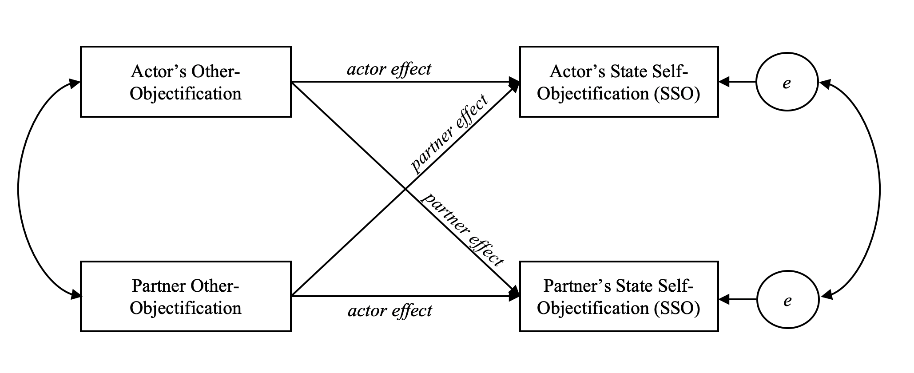

```{r setup, analysis-preferences}
# Seed for random number generation
set.seed(42)
knitr::opts_chunk$set(cache.extra = knitr::rand_seed, include = FALSE)
```
```{r packages, warning = FALSE, message = FALSE}
library(papaja)
library(nlme)
library(haven)
library(devtools)
library(psych)
library(mosaic)
#library(dyadr)
library(tidyr)
library(dplyr)
library(irr)
library(apaTables)
library(knitr)
library(kutils)
library(tidyverse)
library(lavaan)
library(xtable)
library(kableExtra)
library(rmarkdown)
```
@robertsfredrickson's Objectification Theory, suggests that, in addition to being steeped in a culture that objectifies women, women are objectified in actual interpersonal encounters. The negative effects of this interpersonal objectification for women have been theorized to be the strongest under the "male gaze," that is, when it is a perceived or actual man doing the objectifying [@calogero2004test; @gervais2011you; @gay2010my]. What are the consequences when a woman objectifies another woman in an interaction? Psychological researchers studying the sexual objectification of women have in recent years explored the interpersonal process of the objectification, finding evidence for *self*-objectification in the target as a proximal consequence of being objectified [@garcia2016objectification; @strelan2018birds; @riemer2020self]. However, this research has largely focused on mixed-gender interactions only. In a recent review, @gervais2020social organized the extant literature on interpersonal self-objectification and proposed a theoretical model called the Social Interaction Model of Objectification (SIMO). The SIMO focuses on understanding mixed-gender interactions, acknowledging the patriarchal power structure embedded in these mixed interactions, but can this model be extended to interactions among women? Although there is evidence that women can objectify other women [@loughnan2015exploring; @puvia2013being; @gervais2013my], studies investigating the process of interpersonal objectification in interactions between women is scarce. 

The current study uses the face-to-face interaction methodology deployed in @garcia2016objectification to begin to answer a series of research questions about interpersonal objectification among women: Is objectification by a female interaction partner related to an increase in self-objectification for the woman being objectified? Does objectification by a woman have the same downstream negative consequences for women as being objectified by a male interaction partner? The current study addresses these questions by investigating interpersonal objectification among interacting pairs where both partners identify as women. 

##Self-Objectification
Self-objectification is a psychological process that translates the experiences of interpersonal objectification [@loughnan2017internalizing; @gervais2020social] into negative mental health outcomes [e.g., interaction inauthenticity, anxiety, lower self-esteem, and poor cognitive performance; @calogero2011; @moradi2008]. @calogero2011 proposes that self-objectification can be conceptualized as a learned trait, or *trait* self-objectification (TSO), whereby one adopts a habitual third-person perspective on one's own appearance. Furthermore, self-objectification can also be elicited momentarily, for example, when viewing sexualized images in movies and magazines [@morry2001magazine], when trying on sexualizing clothing [@fredrickson1998swimsuit], or during video chat when you believe your interaction partner can only see your body and not your face [@saguyetal2010]. This momentary self-objectification is referred to as *state* self-objectification [SSO; @calogero2011; @moradi2008] and is characterized by feeling like a body rather than a full self within a particular moment, instance, or context. 

Perhaps the most adverse negative consequence of interpersonal objectification is that being objectified socializes girls and women to routinely treat themselves as objects to be looked at and evaluated [@Bartky]. There is experimental and observational evidence that being objectified by another person during an interaction elicits SSO. For example, @loughnan2017internalizing found that for women, imagining a time when they were objectified by another person caused reductions in human traits attributed to the self, and notably, the gender of the person doing the objectification was not a moderating factor. In addition, in a mixed-gender dyadic study of actual interactions, @garcia2016objectification found that men’s reported objectification of their female interaction partner was associated with increased self-objectification in the female partner. Further, this negative effect of the men's objectification on women's SSO was strongest for women higher in TSO. The current study uses this same dyadic paradigm to study same-gender, woman-woman interacting pairs. 

##Women Objectifying Women
Past research investigating women objectifying other women has focused on the psychological conditions that lead women to objectify other women. @harsey2020men found that (trait) self-objectification was related to the objectification of women to a similar degree for male and female participants. Along the same lines, @strelan2005women found that the more women self-objectify, the more they objectify other women. Could the process work in the other direction as well? That is, could objectification by a woman produce (state) self-objectification, in a similar manner to objectification by a man? @hill2008examining assessed women’s experiences of objectification from men independently from women’s experiences of objectification from other women. They found that women may be socialized not only to see themselves as objects, but perhaps to see other women as objects as well. This process, however, was not confirmed to occur during an actual interpersonal interaction. Thus, there is evidence that women do objectify other women, indeed, @loughnan2017internalizing found that women objectify other women to a greater extent than they objectify men. Women have also been found to objectify (dehumanized) sexualized targets presented as images [@puvia2013being], but very little is known about interpersonal sexual objectification among women and what the effects of this objectification might be. Past studies have found that objectification has more adverse consequences for women than men [@gervais2011you; @moradi2008; @saguyetal2010], however, we do not know much about the effect of the gender of the *objectifier* on these potential detrimental outcomes.

##Interpersonal Objectification
Studies have shown that within social encounters women are gazed at more than men [@henley1977body], often times feel ‘looked at’ within interpersonal interactions [@argyle1969], and are likely to internalize the objectifying gaze on their physical self [@puvia2013being]. As mentioned above, interpersonal objectification has been found to have negative consequences for women. @gervais2011you found that an objectifying gaze by a male interaction partner (confederate) was associated with lower math performance for women than being objectified by a female interaction partner.  @gervais2020social recently reviewed the research on interpersonal objectification and organized our current theoretical understanding of this process in the SIMO. What is clear from @gervais2020social's review is that we know little about women-on-women interpersonal objectification, in unstructured contexts. 

Past research has found that the experience of state self-objectification in mixed-gender contexts [stranger and romantic; @strelan2018birds; @meltzer2020women; @zurbriggen2011self] has negative consequences for women, but what about in the context of interactions with other women? Is the self-objectification experienced in mixed-gender interactions associated with the same negative process as that experienced in same-gender interactions? The ample research demonstrating that the male gaze has a particularly detrimental effect for women would suggest no [@saguyetal2010; @calogero2004test; @gervais2011you; @gay2010my]. However, there is evidence that women do objectify other women [@puvia2013being; @loughnan2015exploring; @harsey2020men] and recent experimental evidence suggests that the female gaze causes no less self-objectification than the male gaze [@yilmaz2019whose]. It would be helpful to understand the consequences of this *intra*group objectification for women. When women objectify other women, does it lead to self-objectification in the same way men's objectification of women does [@garcia2016objectification]? 

If so, does the self-objectification experienced in these same-gender interactions have the same negative consequences for authenticity in that interaction?  

One mechanism by which interpersonal objectification translates into negative consequences is interaction inauthenticity - when actors feel that they are not being their true selves in an interaction. There is some evidence that reduced authenticity is a consequence of self-objectification [@garcia2016objectification; @teran2020relational]. A recent study has investigated the effect of self-objectification on the reduction of relationship building skills in general, including same-sex friendships [@teran2020relational]. Authenticity reduction and interaction quality disruptions have also been found in research on stigmatized-stigmatizer interactions [@hebl2005promoting; @richeson2003prejudice; @shelton2005expecting; @pearson2008fragility], and we might view the experience of being objectified in an interaction as a potential identity threat situation [@nadal2012effects; @gervais2020social]. Further, empirical evidence reveals that healthy relationship functioning manifests through authenticity in romantic relationships [@brunelletal2010], at least in an intergroup context such as heterosexual romantic relationships. Evidence for other adverse consequences of interpersonal objectification include reductions in career aspirations [@garcia2016objectification] and a decrease in concentration and impairment in female cognitive performance [@kahalon2018don; @quinnetal]. These are also negative consequences found for women under stereotype threat [@spencer1999stereotype; @davies2005clearing]. When a woman is objectified by a man, and subsequently experiences self-objectification, the intergroup nature and power differential of this encounter might trigger threat. Thus, me might expect there to fewer negative consequences when a woman is objectified by another woman. That is, the intergroup threat literature might predict that woman-woman interpersonal objectification processes diverge from mixed-gender interpersonal objectification processes precisely because they are not intergroup interactions, at least with respect to gender identity. 

In summary, a woman objectified by another woman may not be having the same negative consequences that cascade from situations that trigger group-based identity threat [@deaux1987putting; @dovidio2006nonverbal; @hebl2005promoting]; however, feeling like a body rather than a full human (higher SSO) in any interaction, whether intergroup or intragroup, may be enough to reduce women's feelings of authenticity and social competence, regardless of the gender of the objectifier [@tolman2006looking; @teran2020relational].

##The Current Study
In the current study, we sought to examine what occurs during an interaction in which one or both partners are potentially objectifying each other and where both interaction partners identify as women. Moreover, the current study used the same face-to-face interaction paradigm as @garcia2016objectification and dyadic data analysis techniques to examine the relationships for both women simultaneously. Although the literature on intragroup objectification among women is small, the results are mixed, and they do not cover actual interpersonal encounters, we expected to replicate some of the results found in @garcia2016objectification. Most importantly, we predicted that being objectified by one’s interaction partner would be related to state self-objectification (SSO). We also expected that TSO would moderate this relationship, amplifying the positive association between being objectified and SSO for women higher in TSO. Here we would like to note that @puvia2013being would alternatively predict that women's tendency to self-objectify (TSO) leads them to objectify other women (more precisely, to dehumanize a sexualized woman). In addition, @strelan2005women and @harsey2020men would also predict the TSO to other-objectification link, further theorizing that this relationship is mediated by the woman's own state self-objectification (SSO). Thus, the limited but extant literature on woman-woman objectification points to a possible alternative model from the model tested in the current study. Where appropriate, we report results considering the causal directions implied by this alternative mediation model.

We also tested whether SSO would, in turn, lead to feelings of inauthenticity. The investigation of the SSO to inauthenticity connection is considered exploratory given the lack of support for this connection from the literature on identity threat in *intra*group interactions but support for this connection in the objectification literature [@garcia2016objectification; @teran2020relational; @rollero2016bringing]. Regardless of whether there was an association between SSO and inauthenticity, we hypothesized that feelings of inauthencity would be associated with reduced feelings of agency in romantic relationships, reduced career aspirations, and reduced cognitive performance. In summary, we expected to find a positive relationship between other-objectification by one's partner and state self-objectification. We also expected to find a negative relationship between state-self objectification and interaction authenticity, and that interaction authenticity will be positively related to cognitive performance, relationship agency, and career aspirations.

# Methods

##Procedure
Except for the instructions given to participants, the procedure used was identical to that in @garcia2016objectification. In brief, that methodology is that each participant arrived at the laboratory and were then led into separate cubicles to prevent any communication between the participants before the interaction. In addition, each participant was screened for prior acquaintance to confirm that they had not met prior to the study. They were asked to sign the consent form to participate, and the study was described as follows: “This is a study looking at how students form different types of relationships at college.” A prompt on the computer screen told the participants that they were assigned to the “College Relationships” condition and gave the following instructions:

>There are many types of relationships people form in college. During the interaction, please think about your partner's potential as a romantic partner. **Even if they are not the gender you are attracted to**, you can still judge their potential as a romantic partner. After the interaction you will be asked to evaluate how dateable your partner is. In other words, we would like to know if you think someone would date your interaction partner. Also, your interaction partner will be evaluating you in the same manner. 

*All* participants were told that they were assigned to the "College Relationships" condition. Self-objectification has been found to occur after a mere relationship prime among women [@sanchez2008romance] because, in Western culture and beyond, women need to look attractive to obtain and maintain successful relationships, thus, the "College Relationships" condition may heighten self-objectification and the evaluation of other women in a sexualized way. The decision was made to ask all women participating in the study, even heterosexual women, to judge their fellow-woman partners for their potential as romantic partners. We felt that this prompt would keep the study closest to a replication (and extension) of the previous @garcia2016objectification version of the study, and strengthen the potential for objectification that would normally be low in the context of a psychology laboratory. Recall that, past research has found that heterosexual women are indeed able to evaluate other women's potential as romantic partners, specifically, their sexual attractiveness [@puvia2013being]. Women may be unfortunately quite used to thinking about their own "datability," and we suspected that this habitual thought pattern would translate to their thoughts about other women. Analyses comparing levels of other-objectification between heterosexual and non-heterosexual women are provided in the measures section below.   

After receiving the "College Relationships" prompt, the two participants were then brought into a larger interaction room where they sat on stools prearranged to be approximately 1 meter apart. The experimenter instructed the participants to “get to know each other” for 10 minutes and then left the room. After 10 minutes, the experimenter came back into the room and stopped the interaction. The participants then went back to their individual cubicles and completed a set of post-interaction measures. Participants were then thanked for their participation and debriefed. More detail on this methodology can be found in @garcia2016objectification.

##Participants

```{r data}
clark_final <- read.csv("Cleaned-data/clark_final.csv")
smith_final <- read.csv("Cleaned-data/smith_final.csv")
clarksmith_women <- read.csv("Cleaned-data/clarksmith_women.csv")
```

```{r}
ns <- clarksmith_women %>%
  group_by(smith_or_clark) %>%
  summarise(n = n()) %>%
  as.matrix() %>% as.numeric()
```

Thirty-two previously unacquainted dyads of self-identifying women participated in this study. Data from two demographically similar higher education institutions in the Northeast United States were combined to create the final analysis sample (*N =* `r nrow(clarksmith_women)`) used in this study. In the measures section that follows we refer to them as Sample 1 and Sample 2.  Sample 1 (*N =* `r ns[3]`, or 12 pairs) is from a co-ed liberal arts college and Sample 2 (*N =* `r ns[4]`, or 20 pairs) is from a women’s liberal arts college. Initially, data was collected from both same-gender and mixed-gender dyads at both institutions. Sample 1 originally consisted of 22 pairs, 12 men and 32 women. In Sample 2 there were 23 pairs made up of 43 women and one man, as well as two participants who did not identify as either a woman or man. To investigate only same-gender pairs of women, we limited participant data to women in both samples. Due to difficulties in the logistics of dyadic interaction studies, data collection was discontinued after one year at the second institution and the sample size was taken as the number of women-women dyads at this point in time. All results presented below are from models including sample as a control variable.

```{r demographics}
#favstats(~TSO_A, data=clarksmith_women)
#favstats(~a2pSOO_A, data=clarksmith_women)
#favstats(~howbody_avg_A, data=clarksmith_women)
#favstats(~relag_A, data=clarksmith_women)
#favstats(~careerasp_A, data=clarksmith_women)
#favstats(~authenticity_A, data=clarksmith_women)
#favstats(~trigram_score_A, data=clarksmith_women)

#Mean and SD of age of sample
mean_age <- favstats(~age_A, data = clarksmith_women)$mean
sd_age <- favstats(~age_A, data = clarksmith_women)$sd
tally(clarksmith_women$race_A == clarksmith_women$race_P)

#Calculating race percentages
tally(~race_A, data = clarksmith_women)  #Note that we can add "format = percentage" and not need to calculate
percentage_black <- 6/(6+18+31+6+3)*100
percent_asian <- 18/(6+18+31+6+3)*100
percent_white <- 31/(6+18+31+6+3)*100
percent_latinx <- 6/(6+18+31+6+3)*100
percent_other <- 3/(6+18+31+6+3)*100
tally(~sexor_A, data=clarksmith_women)
percent_straight <-(41/64)*100
percent_queer <- (3+8+5)/64*100
tally(~gender_A, data=clarksmith_women)

table(clarksmith_women$race_A, clarksmith_women$race_P)
samerace_white <- 16/2 #divide by 2 since table is people, not pairs
samerace_minority <- (6+2)/2
mixedrace_white <- 2+10+2+1
mixedrace_minority <- 1+2+1+1

test <- clarksmith_women %>%
  filter(race_A==3, race_A!=race_P)

tally(~gender, data=clark_final)
tally(~gender, data=smith_final)
```

The participants were mostly first-year college students, with an average age of `r mean_age` (SD = `r sd_age`). The sample was `r percent_white`% White/European American, `r percentage_black`% Black/African-American, `r percent_asian`% Asian/Pacific Islander, `r percent_latinx`% Latinx, and `r percent_other`% mixed-race. There were `r samerace_white` White/White pairs and `r samerace_minority` same race racial minority pairs, for a total of `r samerace_white + samerace_minority` same-race pairs. The remaining `r mixedrace_white + mixedrace_minority` were mixed race pairs, of which `r mixedrace_white` were White/racial minority pairings and `r mixedrace_minority` were different racial minority group pairs. `r percent_straight`% of the sample identified as heterosexual, and `r percent_queer`% identified as gay, lesbian or bisexual. See the analysis of differences between heterosexual and non-heterosexual women in levels of other-objectification of their female partners in the measures section below. 

## Measures

```{r correaltions}
#NOT SURE WHAT THIS CHUNK WAS FOR BUT ITS NOT NEEDED

# clarksmith_correlations <- clarksmith_women %>%
#   select(TSO_A, authenticity_A, a2pSOO_A, howbody_avg_A, 
#          relag_A, careerasp_A,  trigram_score_A, TSO_P, 
#          authenticity_P, a2pSOO_P, howbody_avg_P, 
#          relag_P, careerasp_P, trigram_score_P)
# 
# #Correlation tables
# correlations <- apa.cor.table(clarksmith_correlations, table.number=1)
```

```{r corrtable, include=TRUE, echo=FALSE, results='asis'}
#Table 1
glrstab<- function(x, export=FALSE) {
 
 r <-corr.test(x)$r	#taking just the correlation matrix; no N, or p
 p <-corr.test(x)$p	#taking the p*s
 
#define notions for significance levels
 mystars <- ifelse(p < .001, "**"
                   , ifelse(p < .01, "**"
                            , ifelse(p < .05, "*"
                                     , ifelse(p < .10, "+", " "))))
 
 #round r, define new matrix Rnew with the correlations from rnd and paste mystars
 rnd  <- papaja::printnum(r, gt1 = FALSE, digits = 2)  #round, drop leading 0 - Thanks CRSH!								                     
 Rnew <- matrix(paste(rnd, mystars, sep=""), ncol=ncol(rnd)) 
 
#remove 1.0 correlations from diagonal and set the strings
 diag(Rnew) <- ''		
 Rnew[upper.tri(Rnew)] <- ''								                	
 
 rownames(Rnew) <- paste(1:ncol(rnd), colnames(rnd), sep=" ")         #define number and name
 colnames(Rnew) <- paste(1:ncol(rnd), "", sep="") 			       #define number
 
#fun-part: we trim the top half 
 Rnew[upper.tri(Rnew)] <- ''			
 Rnew
 
 Rnew <- cbind(round(describe(x)[,3:4],2), Rnew)		 #describe x, M sD - put them in the matrix
 colnames(Rnew)[1:2] <- c("M","SD")			#Beschriftung der neuen Spalten-"labeling of the new columns"
 Rnew <- Rnew[,1:(ncol(Rnew)-1)]							   	#delete the last column (ugly)
 
 #export to clipboard
 
   if (export==TRUE){
   result<-write.table(Rnew
                       , "clipboard"
                       , sep=";"
                       , row.names=FALSE)
 }
 else result <- Rnew
 return(result)
 
}

corr_cswomen <-clarksmith_women %>%
  select(TSO_A, a2pSOO_A, a2pSOO_P, howbody_avg_A, authenticity_A, relag_A, trigram_score_A, careerasp_A)

corr.table <- glrstab(corr_cswomen)
rownames(corr.table) <- c("1. Actor's trait self objectification (TSO)", "2. Actor's objectification of partner", "3. Partner's objectification of the actor", "4. Actor's state self-objectification", "5. Actor's authenticity of interaction", "6. Actor's future relationship agency", "7. Actor's cognitive performance", "8. Actor's career aspirations")
colnames(corr.table)   <- c("$M$", "$SD$", "1.", "2.", "3.", "4.", "5.", "6.", "7.")

apa_table(corr.table, caption="Correlations and Descriptive Statistics among Study Variables", escape=FALSE, note = "* p < .05. ** p < .01.")
```

```{r descriptives}
descriptives_cswomen <- clarksmith_women %>%
  select(TSO_A, authenticity_A, a2pSOO_A, howbody_avg_A, relag_A, trigram_score_A)
descriptives <- describe(descriptives_cswomen)

descriptives <- descriptives %>%
  select(mean, sd)

# rownames(descriptives) <- c("Actor's trait self objectification (TSO)", 
#                             "Actor's authenticity of interaction", 
#                             "Actor's objectification of partner", 
#                             "Actor's state self-objectification", 
#                             "Actor's future relationship agency", 
#                             "Actor's cognitive performance")
# 
# colnames(descriptives) <- c("M", "SD")

#apa_table(descriptives, caption = "Descriptive Statistics for Study Variables")
```

```{r}
#Reliabilities and some descriptives

#Cognitive performance - Full sample
mean_trigram <- favstats(~trigram_score_A, data=clarksmith_women)$mean
sd_trigram <- favstats(~trigram_score_A, data=clarksmith_women)$sd

##SOO
#Clark
clark_extsoo_alpha <- psych::alpha(select(clark_final, otherint_1, otherint_2, 
                                          otherint_5, otherint_6, otherint_10))$total[2]
clark_intsoo_alpha <- psych::alpha(select(clark_final, otherint_3, otherint_4, 
                                          otherint_7, otherint_8, otherint_9, otherint_11, 
                                          otherint_12))$total[2]
#Smith
smith_extsoo_alpha <- psych::alpha(select(smith_final, otherint_1, otherint_2, otherint_5, 
                                          otherint_6, otherint_10))$total[2]
smith_intsoo_alpha <- psych::alpha(select(smith_final, otherint_3, otherint_4, otherint_7, 
                                          otherint_8, otherint_9, otherint_11, otherint_12))$total[2]
descsplit <- clarksmith_women %>%
  group_by(sexor_A == 1) %>%
  summarize(mean_soo = mean(a2pSOO_A, na.rm = TRUE),
            sd_soo = sd(a2pSOO_A, na.rm = TRUE))

soo_diff <- t.test(a2pSOO_A ~ (sexor_A == 1), data = clarksmith_women)

##Interaction Authenticity
#Clark
clark_intauth_alpha <- psych::alpha(select(clark_final, inter_1, inter_3, inter_5, 
                                           inter_6, inter_7, inter_9, inter_10, interaux_5, 
                                           interaux_6))$total[2]
#Smith
smith_intauth_alpha <- psych::alpha(select(smith_final, inter_1, inter_3, inter_5, inter_6, 
                                           inter_7, inter_9, inter_10, interaux_5, 
                                           interaux_6))$total[2]

##SSO
#Clark - two items
clark_howbody_alpha<- psych::alpha(select(clark_final, howbody_1, howbody_2))$total[2]
#Smith - two items
smith_howbody_alpha <- psych::alpha(select(smith_final,  howbody_1, howbody_2))$total[2]
#Clark - three items
clark_howbody3 <- psych::alpha(select(clark_final, howbody_1, howbody_2, howbody_3))
#Smith - three items
smith_howbody3 <- psych::alpha(select(smith_final, howbody_1, howbody_2, howbody_3))

##Relationship Agency
#Clark
clark_relag_alpha <- psych::alpha(select(clark_final, relag_1, relag_2, relag_3, 
                                         relag_4, relag_5, relag_6, relag_7, relag_8, 
                                         relag_9.r))$total[2]
#Smith
smith_relag_alpha <- psych::alpha(select(smith_final, relag_1, relag_2, relag_3, relag_4, 
                                         relag_5, relag_6, relag_7, relag_8, 
                                         relag_9.r))$total[2]

#corr.test(select(clark_final, relag_1, relag_2, relag_3, relag_4, relag_5, relag_6, relag_7, relag_8, relag_9.r))
#corr.test(select(smith_final, relag_1, relag_2, relag_3, relag_4, relag_5, relag_6, relag_7, relag_8, relag_9.r))
##DROPPING ITEM 9
clark_relag_alpha <- psych::alpha(select(clark_final, relag_1, relag_2, relag_3, 
                                         relag_4, relag_5, relag_6, relag_7, relag_8))$total[2]

smith_relag_alpha <- psych::alpha(select(smith_final, relag_1, relag_2, relag_3, relag_4, 
                                         relag_5, relag_6, relag_7, relag_8))$total[2]

##Career Aspirations
#Clark
clark_final <- clark_final %>% #reverse code certain career aspiration variables
  mutate(careerasp4.r = (min(careerasp_4, na.rm = TRUE) + max(careerasp_4, na.rm = TRUE) - careerasp_4),
         careerasp7.r = (min(careerasp_7, na.rm = TRUE) + max(careerasp_7, na.rm = TRUE) - careerasp_7),
         careerasp10.r = (min(careerasp_10, na.rm = TRUE) + max(careerasp_10, na.rm = TRUE) - careerasp_10))

clark_careerasp_alpha <- psych::alpha(select(clark_final, careerasp_1, careerasp_2, 
                                             careerasp_3, careerasp4.r, careerasp_5, 
                                             careerasp_6, careerasp7.r, careerasp_8, 
                                             careerasp_9, careerasp10.r))$total[2]
#Smith
smith_final <- smith_final %>% #reverse code certain career aspiration variables
  mutate(careerasp4.r = (min(careerasp_4, na.rm = TRUE) + max(careerasp_4, na.rm = TRUE) - careerasp_4),
         careerasp7.r = (min(careerasp_7, na.rm = TRUE) + max(careerasp_7, na.rm = TRUE) - careerasp_7),
         careerasp10.r = (min(careerasp_10, na.rm = TRUE) + max(careerasp_10, na.rm = TRUE) - careerasp_10))

smith_careerasp_alpha <- psych::alpha(select(smith_final, careerasp_1, careerasp_2, 
                                             careerasp_3, careerasp4.r, careerasp_5, 
                                             careerasp_6, careerasp7.r, careerasp_8, 
                                             careerasp_9, careerasp10.r))$total[2]   

###TSO
#Clark--external and internal
clark_funcTSO_alpha <- psych::alpha(select(clark_final, tso_1, tso_2, tso_4, tso_7, tso_9), check.keys=TRUE)$total[2]
clark_physTSO_alpha <- psych::alpha(select(clark_final, tso_3, tso_5, tso_6, tso_8, tso_10), check.keys=TRUE)$total[2]

#Smith--external and internal
smith_funcTSO_alpha <- psych::alpha(select(smith_final, tso_1, tso_2, tso_4, tso_7, tso_9), check.keys=TRUE)$total[2]
smith_physTSO_alpha <- psych::alpha(select(smith_final, tso_3, tso_5, tso_6, tso_8, tso_10), check.keys=TRUE)$total[2] 
```


```{r measures, include=TRUE, echo=FALSE, results='asis'}
############### TABLE MAKING ###################

source <- c("@mcfarlin1984remote", 
            "@garcia2016objectification", 
            "@garcia2016objectification", 
            "@saguyetal2010", 
            "@garcia2016objectification", 
            "@grayobrien2007", 
            "@nollfredrickson1998")

ex_item <- c("The correct answer for the trigram \"Quack: Pond: Waddle\" would be \"Duck\"",
             "\"During the interaction, how often did you think about your partner’s personality?\" (...friends, family, and extracurricular interests, body, appearance, clothing, and body parts) on a scale from 1 (not at all) to 7 (constantly). A difference between the average internal and exxternal traits is taken",
             "\"During the interaction, to what extent did you feel comfortable?\" (...happy, friendly, warm, easygoing, sincere, and authentic) on a scale ranging from 1 (not at all) to 7 (very much)",
             "\"During the interaction I felt more like a body than a full self\"",
             "\"ask someone out on a date\" Responses were measured on a scale ranging from 1 (not at all likely) to 7 (extremely likely)",
             "\"I hope to become a leader in my career field\"",
             "Participants rank order aspects of their bodies from 1 (least important) to 10 (most important): weight, sex appeal, physical attractiveness, firm/sculpted muscles and body measurements, strength, physical coordination, energy level, health and physical fitness. Difference scores were computed by subtracting the sum of the 5 functional aspects/competence attributes (e.g., health, strength) from the sum of the 5 physical self-concepts/appearance attributes (e.g., physical attractiveness, weight), and all measures were multiplied by -1 so that positive scores indicated greater TSO.")

alpha_s1 <- c("Not avaliable",
paste("external: ", printnum(clark_extsoo_alpha)[1,1], "; internal: ", printnum(clark_intsoo_alpha)[1,1]),
printnum(clark_intauth_alpha)[1,1],
printnum(clark_howbody_alpha)[1,1],
printnum(clark_relag_alpha)[1,1],
printnum(clark_careerasp_alpha)[1,1],
paste("appearance: ", printnum(clark_physTSO_alpha)[1,1], "; competence: ", printnum(clark_funcTSO_alpha)[1,1]))

alpha_s2 <- c("Not avaliable",
paste("external: ", printnum(smith_extsoo_alpha)[1,1], "; internal: ", printnum(smith_intsoo_alpha)[1,1]),
printnum(smith_intauth_alpha)[1,1],
printnum(smith_howbody_alpha)[1,1],
printnum(smith_relag_alpha)[1,1],
printnum(smith_careerasp_alpha)[1,1],
paste("appearance: ", printnum(smith_physTSO_alpha)[1,1], "; competence: ", printnum(smith_funcTSO_alpha)[1,1]))

meas_table <- data.frame(source, ex_item, alpha_s1, alpha_s2)

rownames(meas_table) <- c("Cognitive performance", 
                          "Objectification of partner", 
                          "Authenticity of interaction", 
                          "State self-objectification", 
                          "Relationship agency", 
                          "Career aspirations", 
                          "Trait self objectification (TSO)")
                          
colnames(meas_table)   <- c("Original Source", "Example Item", "Reliability Sample 1", "Reliability Sample 2")

# kable(meas_table, "latex", align = "l", booktabs = T, linesep="", caption = "A very long table", longtable=T) %>%
#   column_spec(1, width = "5em", bold = F, italic = F) %>%
#   kable_styling(font_size = 7) %>% 
#   column_spec(2, width = "8em", bold = F, italic = F) %>% 
#   kable_styling(latex_options = "repeat_header") %>%
  
apa_table(meas_table, caption="Measures", escape=FALSE, landscape = TRUE, font_size = "small")

write.csv(meas_table, "meas_table.csv") 

####REproducible example from github - in here is the answer to floating kable tables.. maybe with "longtable"
# table1 <- tibble(first=rep(letters,3),
#                  second = rnorm(78,10,2))
# 
# kable(table1, "latex", align = "l", booktabs = T, linesep="", caption = "A very long table", longtable=T) %>% 
#   column_spec(1, width = "5em", bold = F, italic = F) %>%
#   kable_styling(font_size = 7) %>% 
#   column_spec(2, width = "8em", bold = F, italic = F) %>% 
#   kable_styling(latex_options = "repeat_header")
```

The same set of measures given in @garcia2016objectification were given to participants in the current study. For more details about each of these measures please refer to that previous paper. To summarize here, the list of measures in the order given to participants appears in Table\ \@ref(tab:measures) along side the original source for each scale, an example item, and the reliability in the current sample. Correlations and descriptive statistics of all study variables appear in Table\ \@ref(tab:corrtable). 

Cognitive performance as measured with the Remote Associates Task's trigrams [@mcfarlin1984remote] was given first after the interaction to capture any immediate cognitive effects of the interaction. Next participants were given a set of self-report measures about their thoughts and feelings during the interaction that included State-Other Objectification, Interaction Authenticity, and State Self-Objectification. Breaking from the @garcia2016objectification methodology, we used a three item state self-objectification scale as originally given in @saguyetal2010, but in both samples the reliability of the scale was higher once the third item was removed, so we chose to only use the first two items for our measure of SSO. Following these interaction measures, participants completed the Relationship Agency Scale and the Career Aspirations Scale. The Relationship agency scale originally had 9 items, but the 9th item had low correlations with the remaining items so it was trimmed. As a result, the 8-item scale had moderately high reliability for both samples (see Table\ \@ref(tab:measures)). Lastly, as was the case in @garcia2016objectification, Trait Self-Objectification was given last, as not to arouse suspicious at the start of the study that we were actually focusing on objectification and to give enough time that immediate effects of the interaction would have worn off. 

As can be seen in Table\ \@ref(tab:corrtable), the mean other-objectification of women by women was *M =* `r descriptives[3,1]` (*SD =* `r descriptives[3,2]`). This corresponds to women objectifying other women to a *greater* extent than women's objectification of men reported in @garcia2016objectification (*M =* -1.68, *SD =* 1.52). Further, in the current sample the difference in other-objectification between heterosexual (*M =* `r round(as.numeric(descsplit[2,2]),2)`, *SD =* `r round(as.numeric(descsplit[2,3]),2)`) and non-heterosexual women (*M =* `r round(as.numeric(descsplit[1,2]),2)`, *SD =* `r round(as.numeric(descsplit[1,3]),2)`) was not statistically significant, *t*(`r round(soo_diff$parameter,2)`) = `r round(soo_diff$statistic, 2)`, *p =* `r round(soo_diff$p.value,3)`. 

# Results
```{r create_r-references, warning=FALSE, message=FALSE}
r_refs(file = "r-references.bib")

#cite_r("r-references.bib") #There are other packages loaded as well, not sure which ones we use and which ones we dont. Consider putting all loaded packages in supplement.  
```
We used R [Version 3.5.2; @R-base] and the R-packages *tidyverse* [Version 1.2.1; @R-tidyverse], *psych* [Version 1.8.4; @R-psych], and *nlme* [Version 3.1.137; @R-nlme] for our analyses. Further, we used the R-packages *papaja* [Version 0.1.0.9842; @R-papaja], *apaTables* [Version 2.0.5; @R-apaTables], with *knitr* [Version 1.25; @R-knitr] to create a fully reproducible manuscript in *rmarkdown* [Version 1.15; @R-rmarkdown]. 

The R-package *papaja* [Version 0.1.0.9842; @R-papaja] was used to create a fully reproducible APA style manuscript containing the analysis code and manuscript text integrated into one source file. The benefit of this integration is that the numbers reported throughout this document are coded into the text, ensuring that no errors were made during a workflow marked by copying and pasting from statistical software to word processing software. Note that here we are using the term reproducibility to mean getting the same results when running analyses again using the *same* data, not to be confused with replicability meaning collecting a new dataset using the same methods and obtaining the same results [@patil2016statistical]. The source code for this manuscript along with survey materials and experimenter scripts for the study protocol are all available at https://github.com/kkyuchukova/object-in-action. The data unfortunately cannot be made publicly available given the dyadic nature of the observations. That is, with dyadic data, if a person who participated in the study found their own scores, using the dyad identification number, they could then see their partner's scores and thus confidentiality would be breached.

## Analysis Strategy
```{r apim, include=TRUE, echo=FALSE, results='asis', out.width="400px", fig.cap="Basic actor-partner interdependence model (APIM) depiction."}

```

This study sought to detect whether partners’ objectification of one another affected state self-objectification (SSO). Specifically, we were interested in testing the relationship between state-other objectification and SSO, and how SSO in turn, may or may not affect feelings of inauthenticity during the interaction. In addition, we also tested if the effect of other-objectification in an interaction on SSO is only present for those women who are high in trait self-objectification (moderation effect). Further, we investigated the relationships between experiencing interaction inauthenticity and relationship agency, career aspirations, and cognitive performance.

While past studies investigating objectification in interactions used dyadic path analysis [@garcia2016objectification], the current study used multilevel modeling procedures. Dyadic analyses for distinguishable dyads (e.g., mixed-gender interacting pairs) is more natural using Structural Equation Modeling (SEM) than it is for indistinguishable dyads (e.g., same-gender interacting pairs), as we had in the current study [@ledermann2017analyzing; @garcia2015moderation]. One reason for this asymmetry is that, due to the arbitrary distinctions made between "partner 1" and "partner 2" in indistinguishable dyads, many estimates need to be fixed to be equal (i.e., paths, variances, covariances, endogenous intercepts, and exogenous means), but these equality constraints should not then be considered in the degrees of freedom calculations for fit estimations [@olsen2006structural]. Further, @olsen2006structural details how a new independence model and the corresponding fit measure should be re-calculated for indistinguishable dyads models. The current study used dyadic multilevel modeling (MLM) to test all relationships, moderation, and mediation patterns. The online supplementary materials found at https://github.com/kkyuchukova/object-in-action contain model estimates obtained using SEM. See @ledermann2017analyzing for a more complete discussion of the considerations for using SEM versus MLM for dyadic analysis.  

Testing hypotheses and exploring relationships in the current sample of indistinguishable dyads involved using the Actor-Partner Independence Model (APIM) approach for each outcome variable. See Figure\ \@ref(fig:apim) for a basic APIM model. The APIM estimates effects due to one's own, as well as one's partner's, predictor variables on the one's own outcome variable. The current study deals with indistinguishable dyads, meaning the designation of who is the "actor" and who is the "partner" is arbitrary. In total we ran five APIM's---one for each outcome variable---to test the series of the relationships proposed (i.e., for SSO, inauthenticity, career aspirations, relationship agency, and cognitive performance). 

<!-- The model differences as a result of adopting this MLM approach include an examination of the partner effect of TSO on SSO, partner effect of SSO on authenticity, and partner effects of authenticity on congitive performance, relationship agency, and career aspirations.  -->

<!-- We used path analysis to obtain our estimates, but because our sample is nonindependent, we used the indistinguishable actor–partner interdependence model [@olsen2006structural]. The APIM can be defined as a "model of dyadic relationships that integrates a conceptual view of interdependence with the appropriate statistical techniques for measuring and testing it" [@olsen2006structural]. Due to the complexity of the original @garcia2016objectification study, we also had to set the exogenous covariances equal. More specifically, the covariances between TSO, actor and partner objectification, and the interaction between actor TSO and partner objectification (and vice versa). -->

<!-- In order to interpret model fit, which refers to the ability of a model to reproduce the data (i.e., usually the varience-covariance matrix) we utilized both the I-SAT (saturated) model, and the Null model to ensure that all possible corresponding covariences are fixed to be equal across partners. We obtained fit estimates by subtracting the chi-square estimate for the I-SAT model from the analysis model [@olsen2006structural, @peugh2013analyzing]. -->

## Main Results
```{r semfigure, include=TRUE, echo=FALSE, results='asis', out.width="400px", fig.cap="This figure depicts the relationships tested bewteen study variables. The light gray variables represent redundant variables and are shown to emphasize the dyadic nature of the data. The estimates were from obtained from separate MLMs. Sample was controlled for in all models. The effects of TSO, actor other-objectification, and partner other-objectification are from a model where the interaction of TSO and partner other-objectification had been trimmed. *p < .05, dashed lines represent non-significant relationships."}
include_graphics("figures/SEMfigure.png")
```

```{r presentation-functions}
 pround <- function(val){
  ifelse(val < .001,
         return(sub("^(-?)0.", "\\1.", sprintf("%.3f", .001))),
         return(sub("^(-?)0.", "\\1.", sprintf("%.3f", val))))
}

estround <- function(val){
  ifelse(abs(val) < .01,
         return(.01),
         return(round(val, 2)))
}

#only works for merModlmerTest objects or when p-values on are in column 4, "lm" objects
report_stats <- function(mod, est){

  b <- coef(summary(mod))[,1]
  se <- coef(summary(mod))[,2]
  ifelse(class(mod) == "merModLmerTest",
         p <- coef(summary(mod))[,5],
         p <- coef(summary(mod))[,4])

  paste(ifelse(abs(b[est]) < .01,"*b* < ","*b* = "), as.character(estround(b[est])),
        ifelse(se[est] < .01, ", *SE* < ", ", *SE* = "), as.character(estround(se[est])),
        ifelse(p[est] < .001, ", *p* < ", ", *p* = "),  as.character(pround(p[est])),
        ", *95%CI* = [",as.character(estround(confint(mod, est)[1])), ", ", as.character(estround(confint(mod, est)[2])), "]",
        sep = "") %>%
    return()
}
# randomeffects <- as.data.frame(VarCorr(mlm_mod1.0))
# randomeffects2 <- as.data.frame(VarCorr(mlm_mod2.0))
```

```{r}
apim0 <- gls(a2pSOO_A ~ TSO_A, 
                  na.action=na.omit, 
                  correlation=corCompSymm (form=~1|dyadID),
                  data=clarksmith_women)
summary(apim0)
apim0.b <- gls(a2pSOO_A ~ howbody_avg_A + TSO_A, 
                  na.action=na.omit, 
                  correlation=corCompSymm (form=~1|dyadID),
                  data=clarksmith_women)
summary(apim0.b)

#SSO
apim1_empty <- gls(howbody_avg_A ~ 1, 
                 na.action=na.omit, 
                 correlation=corCompSymm (form=~1|dyadID),
                 data=clarksmith_women)

apim1 <- gls(howbody_avg_A ~ a2pSOO_A + a2pSOO_P + TSO_A + a2pSOO_P*TSO_A + smith_or_clark, 
                 na.action=na.omit, 
                 correlation=corCompSymm (form=~1|dyadID),
                 data=clarksmith_women)

apim1.b <- gls(howbody_avg_A ~ a2pSOO_A + a2pSOO_P + TSO_A + smith_or_clark, 
                 na.action=na.omit, 
                 correlation=corCompSymm (form=~1|dyadID),
                 data=clarksmith_women)

summary(apim1)

summary(apim1.b)
summary(apim1_empty)

apim1_r2 <- 1 - (1.094517/1.128858)
```

```{r}
#authenticity
apim2_empty <- gls(authenticity_A ~ 1, 
                 na.action=na.omit, 
                 correlation=corCompSymm (form=~1|dyadID),
                 data=clarksmith_women)
apim2 <- gls(authenticity_A ~ howbody_avg_A + smith_or_clark, 
                 na.action=na.omit, 
                 correlation=corCompSymm (form=~1|dyadID),
                 data=clarksmith_women)

summary(apim2)
summary(apim2_empty)
apim2_r2 <- 1 - (1.029834/1.019483) 

#correlations between howbody and each authenticity item individually. 
min_corr <- min(abs(round(corr.test(select(clarksmith_women, 
                 howbody_avg_A, inter_1_A, inter_3_A, inter_5_A, 
                 inter_6_A, inter_7_A, inter_9_A, inter_10_A, 
                 interaux_5_A, interaux_6_A))$r, 3)[,1]))
max_corr <- as.numeric(sort(abs(round(corr.test(select(clarksmith_women, 
                 howbody_avg_A, inter_1_A, inter_3_A, inter_5_A, 
                 inter_6_A, inter_7_A, inter_9_A, inter_10_A, 
                 interaux_5_A, interaux_6_A))$r, 3)[,1]), decreasing = T)[2])

apim2.b <- gls(authenticity_A ~ howbody_avg_A + a2pSOO_P + smith_or_clark, 
                 na.action=na.omit, 
                 correlation=corCompSymm (form=~1|dyadID),
                 data=clarksmith_women)

summary(apim2.b)

apim2.c <- gls(authenticity_A ~a2pSOO_P + smith_or_clark, 
                 na.action=na.omit, 
                 correlation=corCompSymm (form=~1|dyadID),
                 data=clarksmith_women)

summary(apim2.c)
```

```{r}
#cognitive performance
apim3_empty <- gls(trigram_score_A ~ 1, 
                 na.action=na.omit, 
                 correlation=corCompSymm (form=~1|dyadID),
                 data=clarksmith_women)
apim3 <- gls(trigram_score_A ~ authenticity_A + smith_or_clark, 
                 na.action=na.omit, 
                 correlation=corCompSymm (form=~1|dyadID),
                 data=clarksmith_women)

summary(apim3)
summary(apim3_empty)
apim3_r2 <- 1 - (2.320106/2.295617) 

apim3.b <- gls(trigram_score_A ~ authenticity_A + howbody_avg_A + smith_or_clark, 
                 na.action=na.omit, 
                 correlation=corCompSymm (form=~1|dyadID),
                 data=clarksmith_women)

summary(apim3.b)

apim3.c <- gls(trigram_score_A ~ authenticity_A + howbody_avg_A + a2pSOO_P + smith_or_clark, 
                 na.action=na.omit, 
                 correlation=corCompSymm (form=~1|dyadID),
                 data=clarksmith_women)

summary(apim3.c)
```

```{r}
#relationship agency
apim4_empty <- gls(relag_A ~ 1, 
                 na.action=na.omit, 
                 correlation=corCompSymm (form=~1|dyadID),
                 data=clarksmith_women)
apim4 <- gls(relag_A ~ authenticity_A + smith_or_clark, 
                 na.action=na.omit, 
                 correlation=corCompSymm (form=~1|dyadID),
                 data=clarksmith_women)

summary(apim4)
summary(apim4_empty)
apim4_r2 <- 1 - (0.9420959/0.9556186)

apim4.b <- gls(relag_A ~ authenticity_A + howbody_avg_A + smith_or_clark, 
                 na.action=na.omit, 
                 correlation=corCompSymm (form=~1|dyadID),
                 data=clarksmith_women)

summary(apim4.b)

apim4.c <- gls(relag_A ~ authenticity_A + howbody_avg_A + a2pSOO_P + smith_or_clark, 
                 na.action=na.omit, 
                 correlation=corCompSymm (form=~1|dyadID),
                 data=clarksmith_women)

summary(apim4.c)
```

```{r}
#career aspirations
apim5_empty <- gls(careerasp_A ~ 1, 
                 na.action=na.omit, 
                 correlation=corCompSymm (form=~1|dyadID),
                 data=clarksmith_women)
apim5 <- gls(careerasp_A ~ authenticity_A + smith_or_clark, 
                 na.action=na.omit, 
                 correlation=corCompSymm (form=~1|dyadID),
                 data=clarksmith_women)

summary(apim5)
summary(apim5_empty)
apim5_r2 <- 1 - (0.5816273/0.6068203)

apim5.b <- gls(careerasp_A ~ authenticity_A + howbody_avg_A + smith_or_clark, 
                 na.action=na.omit, 
                 correlation=corCompSymm (form=~1|dyadID),
                 data=clarksmith_women)

summary(apim5.b)

apim5.c <- gls(careerasp_A ~ authenticity_A + howbody_avg_A + a2pSOO_P + smith_or_clark, 
                 na.action=na.omit, 
                 correlation=corCompSymm (form=~1|dyadID),
                 data=clarksmith_women)

summary(apim5.c)
```

```{r mlm, include=TRUE, results='asis'}
# fit_table <- bind_rows(xtable(summary(apim1)$tTable))
# 
# 
# colnames(fit_table) <- c("Estimate", "SE", "z-value", "p-value")
# 
# apa_table(fit_table, caption = "Estimates from Multilevel Models", font_size = "small")
```

All relationships between study variables and the MLM estimates are depicted in Figure\ \@ref(fig:semfigure). 

First, we used the APIM to test for evidence of a partner effect of other objectification and SSO in this sample of same-gender woman-woman interacting dyads. In @garcia2016objectification, men's objectification of women was significantly related to women's SSO, the current study sought to replicate this partner effect. As expected, the partner effect of other-objectification on SSO in the current all-women sample was statistically significant, `r report_stats(apim1, 3)`. That is, the extent to which one's partner reported thinking about a woman's external characteristics more than her internal characteristics was significantly related to the woman's own reported feeling more like a body than a full self. Along side the @garcia2016objectification study, there is now evidence that interpersonal objectification in an actual interpersonal encounter is related to state self-objectification for women both when the objectifier is a man and when the objectifier is a woman.  

In addition to partner other-objectification, this model also included one's own objectification of their partner (actor other-objectification), actor trait self-objectification (TSO), and the interaction of partner other-objectification and TSO. One's own other objectification had no significant effect on SSO (actor effect of other-objectification), `r report_stats(apim1, 2)`. Further, inconsistent with past findings, there was no statistically significant interaction of partner's other objectification and the person's trait self-objectification on SSO, `r report_stats(apim1, 5)`. There was also no significant main effect of trait self-objectification on SSO `r report_stats(apim1.b, 4)`. The $R^2$ of this model (which includes the partner effect of other-objectification discussed in the previous paragraph) was only `r round(apim1_r2,2)`. 

As a test of the potential alternative models discussed in the introduction---if trait-self-objectification is positively related to objectifying one's partner---we ran a MLM with other-objectification predicted by actor TSO. There was no statistically significant relationship between these two variables, `r report_stats(apim0, 2)`. We also ran a model with both TSO and SSO predicting other-objectification, given past theorizing that state self-objectification might mediate the relationship between TSO and objectification of fellow women, but there was also no effect of SSO on other-objectification in this model, `r report_stats(apim0.b, 2)`.

We next moved on to test the link between SSO and interaction authenticity. There was no significant effect of SSO on interaction authenticity, although the estimate of this effect was in the hypothesized negative direction, `r report_stats(apim2, 2)`. Because authenticity was a composite score of 9 items, two of which were interaction specific authenticity items, we also estimated the pairwise correlations between SSO and all these items individually. They were all small, ranging from only `r -1*min_corr` to `r -1*max_corr`. Although we hypothesized that SSO would mediate the relationship between partner's other objectification and interaction authenticity, after finding no relationship between SSO and authenticity, we also tested if the partner's other objectification had a direct effect on authenticity, but this effect was not significant, `r report_stats(apim2.b, 3)` (nor was the total effect of partner's other objectification on authenticity, `r report_stats(apim2.c, 2)`). Note that these analyses of the relationship between SSO and inauthenticity in this same-gender sample were considered exploratory, given that prior research on intragroup interactions points to mixed possibilities.

Lastly, although there was no evidence that SSO was related to interaction authenticity in the current sample, we tested if interaction authenticity (composite of nine items) had effects on cognitive performance, career aspirations, and relationship agency, as it did in @garcia2016objectification. We again used MLM and thus, these effects were tested in three separate multilevel linear models. There was no significant effect of interaction authenticity on cognitive performance, `r report_stats(apim3, 2)`, but authenticity was significantly positively related to both career aspirations, `r report_stats(apim5, 2)` ($R^2 =$ `r round(apim5_r2,2)`), and relationship agency, `r report_stats(apim4, 2)` ($R^2 =$ `r round(apim4_r2,2)`).

<!-- ^[There was no direct effect of SSO on cognitive performance, `r report_stats(apim3.b, 3)`, and no direct effect of partner's other objectification on cognitive performance, `r report_stats(apim3.c, 4)`. There was no direct effect of SSO on career aspirations, `r report_stats(apim5.b, 3)`, and no direct effect of partner's other objectification on career aspirations, `r report_stats(apim5.c, 4)`. There was no direct effect of SSO on relationship agency, `r report_stats(apim4.b, 3)`, and no direct effect of partner's other objectification on relationship agency, `r report_stats(apim4.c, 4)`.] -->

# Discussion
The current study tested whether the model of interpersonal objectification and state self-objectification (SSO) used in @garcia2016objectification replicates in a sample of women engaging in actual dyadic interactions with each other. Although past research has found that women do objectify other women [@puvia2013being; @loughnan2015exploring; @harsey2020men], this is the first study to test if *interpersonal* other-objectification by women during actual interactions is related to state self-objectification in their woman-identified interaction partners. As hypothesized, the current study did find a significant relationship between a woman's interaction partner's report of having objectified her and her own post-interaction feelings of self-objectification. That is, there was a significant partner effect of other-objectification on SSO. This effect extends the equivalent relationship found in mixed-gender interactions to the context of same-gender interactions between women. Thus, evidence suggests that it is not only the real or imagined male gaze that is related to women's state self-objectification, but there is now also evidence that being objectified by another woman could be related to women's SSO, at least in the context of a scenario where they know they are being evaluated as a potential dating partner. 

As is the case in all correlational studies, we cannot be sure about the causal direction between other-objectification and SSO. The linear model used by the current study implies that being objectified by a woman leads women to self-objectify, but it could be that women's SSO causes them to be objectified by their interaction partner. This latter interpretation is possible given the empirical evidence that it is *women's* state self-objectification that relates to being objectified by one's partner---men-identifying partners [@garcia2016objectification] and now women-identifying partners. Objectification Theory [@robertsfredrickson], as well as some past experimental studies [for example, @saguyetal2010], suggest that the causal flow is from other-objectification to SSO. Other studies, especially those investigating women objectifying other women [@puvia2013being], have found evidence that women's *trait* self-objectification is related to women objectifying (dehumanizing) other women and this link is mediated by *state* self-objectification. The process of interpersonal objectification among women could also very well contain a feedback loop. That is, perhaps we tend to objectify other women who objectify us. Then, if there tended to be reciprocity in sexual objectification among women, through a process of TSO causing SSO which in turn causes other-objectification of one's partner, which in turn causes one's partner to objectify us, and finally, being objectified further increases our own SSO. However, the current study does not provide any evidence of the TSO to other-objectification link (through SSO or directly)---TSO was not significantly correlated with SSO. Further, actor's other-objectification was not correlated with partner's other-objectification in the current sample.    

Where the results of the current study diverge most notably from the results of studies testing interpersonal objectification among mixed-gender dyads is the lack of evidence for relationships between SSO and interaction inauthenticity (and, in turn, cognitive functioning). This is somewhat surprising given the extant evidence linking SSO and cognitive functioning [@fredrickson1998swimsuit; @quinn2011performance; and see @moradi2008 for a review] and the research on interpersonal other-objectification and cognitive functioning [@logel2009interacting; @garcia2016objectification; @gervais2011you]. This lack of evidence could potentially signal diverging processes between women's experiences with interpersonal objectification from men and interpersonal objectification from women. There is quite a bit of evidence suggesting that the male gaze is particularly detrimental [@calogero2004test; @robertsfredrickson; @gervais2011you], and perhaps the self-objectification experienced within an interaction with a women is qualitatively different, as the state self-objectification experienced within an interaction with a man. However, as a strong note of caution, it is best not to interpret a null result as evidence of no relationship and more research on interpersonal objectification among women is needed. 

The lack of evidence for a relationship between SSO and interaction authenticity is surprising and again, should not be interpreted as evidence of no relationship. It should be noted that the estimate of this relationship was small (close to zero), but in the negative direction. If it is the case that there is a smaller (i.e., weaker) or zero connection between women's feelings of SSO and inauthenticity in interactions with other women than in interactions with men, models of interpersonal objectification, like the SIMO [@gervais2020social], could be extended by including gender of the objectifier/interaction partner as a moderator. Inauthenticity could be added as a potential moderated mediating factor to help understand the circumstances that require other-objectification and SSO to have negative consequences for women. Perhaps one important difference is the lack of a power differential across gendered lines---the patriarchal culture is present, but the interaction partners are not a stigmatizer-stigmatized pair. This work on intragroup sexual objectification among women could also have connections to the small but growing literature investigating same-race racial minority interactions [@taylor2018threat; @garcia2017racial].    

Although the current study did not find a connection between SSO and authenticity, we did find significant positive relationships between authenticity and relationship agency, and authenticity and career aspirations. The relationship between authenticity and cognitive functioning was also estimated as positive, but was not statistically significant. Again, due to the lack of connection between SSO and authenticity, we found no evidence of *indirect* relationships between SSO and these outcome variables. This evidence of a relationship between authenticity and the relational outcome variables (i.e., relationship agency and career aspirations) provides evidence that corroborates past findings that felt authenticity in interactions is important for healthy relationship functioning [@garcia2016objectification; @teran2020relational] and is related to mental health correlates [@tolman2006looking]. Just as authenticity has been found to be important in intergroup interactions [@brunelletal2010; @garcia2016objectification], we find more evidence here that disruptions in feelings of authenticity can negatively impact relationships beyond the current partner. Although the current study did not find a connection between authenticity and SSO, this seems theoretically to be a natural connection, and future work must explore when and how SSO leads to inauthenticity in interpersonal objectification situations. 

##Limitations and Future Directions

###Sample Characteristics
In addition to being relatively small and combined across two institutions, another limitation of the current study sample is that the it was comprised of mostly women from Western cultures. Being that self-objectification has been found to be most prevalent in Western culture [@loughnan2015exploring], research on objectification that includes people from non-Western cultures has been scarce [@moradi2008], although more recent work has examined objectification from a cross-cultural framework [@loughnan2015exploring, @wollast2020cultural]. Further, sexualizing experiences and self-objectification are thought to begin a very young age, but researchers have only recently begun to examine such experiences among children [e.g., @holland2016; @jongenelis2014]. The mean age of the current sample was `r mean_age` years, a young adult sample. Further, more longitudinal studies investigating the developmental experience of interpersonal objectification and self-objectification are needed, especially because the processes of self-objectification have been found to unfold between the periods of adolescence and young adulthood [@vangeel2018multidimensional]. 

###Interpersonal Sexual Objectification, Gender, and Sexual Attraction
The current sample contained a mixture of heterosexual and non-heterosexual women, but all participants were asked to think about and evaluate their partner as a potential dating/romantic partner. We think that the heterosexual women in our sample were able to do this with other women as their target---indeed, there is evidence that they might do this readily [@strelan2005women; @puvia2013being]---but, perhaps they may be even more apt to activate social comparison processes [@festinger1954theory] than women who are sexually attracted to other women (non-heterosexual women). These differential psychological process between heterosexual and lesbian women might have served to dampen our ability to detect the proposed relationships between study variables.

<!-- Previous research has found that when compared to heterosexual women, lesbian women report less concern with physical appearance [@siever1994sexual; @strong2000eating], lower body surveillance [@hill2008examining], and lower self-objectification [@noffsinger2004objectification]. However none of these studies examined the relationship between self-objectification and experiences of sexual objectification. Thus, it is unclear whether lesbian women indeed experience similar levels of cultural sexual objectification but internalize them less than heterosexual women do. Consistent with previous research, @hill2008examining determined that lesbians exhibited less physical appearance concerns compared to heterosexual women, however there was no evidence found that lesbian women self-objectify less than heterosexual women and they did not find that sexual orientation moderates the relationship between sexual objectification and self-objectification. This evidence sits in contrast to older theoretical literature that suggests that lesbians internalize cultural sexual objectification less than do heterosexual women [@brown1987lesbians; @pitman1999body; @rothblum1994lesbians; @siever1994sexual].  -->

<!-- Interpersonal sexual objectification has been studied in both romantic and platonic contexts. Among heterosexual male and female college students, self-objectification has been found to be positively associated with the extent to which they objectify their romantic partners [@zurbriggen2011self]. Evidence is mixed, suggesting that women can sometimes have positive outcomes from appearance valuation within the context of an established romantic relationship. There is also evidence that they experience less SSO after appearance comments within established romantic relationships [@meltzer2020women], but less is known about first dates. An important caveat to this literature is that it is only about heterosexual relationships. Objectification might also occur among platonic friends: Perhaps women could be amplifying each others' state self-objectification *before* the theoretical encounters with men organized in the SIMO occur. In this way, women's rituals of getting ready together before socializing in co-ed groups might place even women with low TSO in a higher SSO group.  -->

###Sexism and Sexual Discrimination
Sexism has been found to be related to the objectification of women, but not men [@cikara2011agents; @harsey2020men], and in addition, TSO has been found to be associated with less negative attitudes towards sexual harassment [@bernard2018bodies]. Both of these effects are present for both men and women. Empirical evidence illustrates how women continue to be objects of interpersonal discrimination and experience daily sexist hassles [@swimetal]. One form of interpersonal discrimination women face is the process by which their whole being is viewed as a collection of sexualized body parts valued predominantly for commodification, a phenomena termed sexual objectification [@Bartky]. Sexual objectification of women has also been linked to trauma [@miles2015stop]. Sexual objectification occurs in a myriad of ways in women's lives and is modified by unique combinations of race, ethnicity, sexuality, age, and class [@robertsfredrickson]. Amid such heterogeneity though, “having a reproductively mature female body” proposed by @robertsfredrickson is likely to create a shared vulnerability to sexual objectification and a variety of shared negative experiences as a result.

#Conclusion
The results of this study ... and additionally highlight the psychological and social consequences of such objectification processes on women’s social relationships and well-being. These results are quite useful for promoting mental health, the creation and maintenance of early action programs for girls and young women, and for scholars and practitioners to work intentionally to provide the tools necessary to circumvent or mitigate negative effects on self-objectification to combat such experiences.

\newpage

#References

\begingroup
\setlength{\parindent}{-0.5in}
\setlength{\leftskip}{0.5in}

<div id = "refs"></div>
\endgroup
